---
title: Modèles hybrides fluide/cinétique pour les plasmas chauds
author: Josselin Massot
bibliography: source/biblio/biblio.bib
...

# Introduction

La simulation numérique fut introduite dès l'émergence de l'informatique pour enrichir les connaissances scientifiques dans des contextes où l'expérimentation est trop contraignante voire impossible. La simulation peut aussi avoir un intérêt prédictif pour dimensionner un problème physique (simulation de tokamak avant leur construction dans le projet ITER) ou pour tester un modèle et le confronter aux futures observations (simulation de nébuleuses ou d'étoiles). La simulation peut être vue comme une retranscription informatique de modèles mathématiques, censés représenter des phénomènes physiques. La simulation numérique doit être représentative de la réalité. Ainsi, dans des modèles où la solution exacte est souvent hors de portée, il est nécessaire de vérifier que la transcription numérique conserve certaines propriétés mathématiques du modèle (conservation de certaines quantités physiques comme la masse ou l'énergie totale par exemple).

Un enjeu majeur de la modélisation et de la simulation est de maintenir un équilibre entre les approximations au niveau du modèle, qui permettent d'accélérer le temps de traitement et la précision des résultats.

Le cadre de ce stage est l'étude d'un système de particules au sein d'un gaz raréfié ou d'un plasma chaud. Un plasma, qualifié de 4e état de la matière (en plus de solide, liquide et gaz), est un système dans lequel différentes charges électriques circulent. Ces charges sont des électrons (charge négative), particules qui sont extraites des atomes, et des ions (charge positive), particules qui résultent de l'extraction des électrons. Le plasma est généralement obtenu en chauffant un gaz à très haute température, ce qui permet d'exciter les particules le constituant et d'arracher des électrons aux atomes. La température, grandeur macroscopique, exprime l'agitation des particules et donc leur vitesse propre (grandeur microscopique) ; le qualificatif *chaud* indique donc que des particules ont des vitesses élevées au sein du plasma. L'étude des plasmas possède de nombreuses applications dans le domaine industriel, telles que la propulsion par plasmas (astronautique), la fusion nucléaire (énergie) et la découpe (industrie).

Pour décrire un tel système de particules, plusieurs possibilités existent. La description dite fluide, qui prend en compte les équations de la mécanique des fluides (comme les équations d'Euler ou de Navier-Stokes) peut être utilisée. Les inconnues de ces équations sont des quantités dites macroscopiques (mesurables expérimentalement) comme la densité, la vitesse moyenne ou la température qui ne dépendent que du temps et de la position. Cependant cette description suppose que le système étudié est à l'équilibre, c'est-à-dire que la répartition en vitesse des particules est maxwellienne. Or lorsque le système est parcouru par une onde de choc ou lorsqu'une population de particules chaudes est présente dans le système, des phénomènes hors équilibre sont à prendre en compte exigeant une description plus précise. On utilise alors la description cinétique. Celle-ci manipule une fonction de distribution dépendant du temps, de l'espace mais aussi de la vitesse des particules, ce qui permet de prendre en compte ces aspects hors équilibre. La complexité de description apportée par le modèle cinétique se traduit numériquement par un coût en temps de calcul et utilisation de la mémoire ; en effet la simulation s'effectue avec les variables $(t,x,v)$ donc $7$ dimensions au lieu de seulement 4 dimensions pour la description fluide, où les inconnues ne dépendent que de $(t,x)$. L'espace mémoire nécessaire pour stocker $f(t=0,x,v)$ sur une grille $100^6$ de l'espace des phases peut être estimé à 7.2To, alors que la description fluide ne nécessite que 7.6Mo sur une grille $100^3$ de l'espace. Une description cinétique n'est donc pas souhaitable sur tout le domaine d'étude si le fluide est proche de son équilibre et des optimisations sont donc envisageables dans ce type de configuration.   
Nous souhaitons développer des modèles hybrides mêlant les avantages des descriptions fluide et cinétique. Notre approche se rapproche des méthodes dites de *décomposition de domaines* pour lesquelles le modèle fluide est utilisé dans les zones où le système est à l'équilibre alors que le modèle cinétique est utilisé uniquement dans les zones où le système est hors équilibre (dans le choc par exemple), approche déjà étudiée dans [@BENNOUNE20083781], [@dimarco] ou [@filbet]. 

L'objectif de ce stage est l'implémentation des méthodes numériques de modèles hybrides fluide-cinétique. Il est alors crucial de développer des méthodes d'ordre élevé de type eulériennes, c'est-à-dire utilisant une grille dans l'espace des phases $(x,v)$.   
Il est intéressant, voire crucial, numériquement de développer des méthodes d'ordre élevé pour capturer les forts gradients pouvant être générés par la solution (présence de structures fines dans l'espace des phases ou de choc), cela permet aussi de limiter la diffusion numérique qui dégrade les résultats sur des temps longs. L'erreur d'une méthode d'ordre $m$ est divisée par $2^m$ lorsque l'on double le nombre de points du maillage, alors que le temps de calcul évoluera de manière plus linéaire en fonction du nombre de points, ainsi une méthode d'ordre élevé avec peu de points devient préférable à une méthode d'ordre faible avec plus de points.   
Dans des conditions physiques réalistes, il est nécessaire de prendre en compte des conditions aux bords de type Dirichlet ou Neumann. Ces conditions peuvent être délicates à exprimer pour des méthodes d'ordre élevé. Ainsi, même si la majorité de l'étude est consacrée à des conditions aux bords périodiques, un des enjeux de ce stage fut d'implémenter les conditions aux bords de type Neumann.

Ce stage a été consacré à l'étude, la dérivation et la validation numérique de modèles hybrides fluide-cinétique en les comparant de façon systématique aux modèles d'Euler (fluide) et cinétique. L'objectif est de construire un modèle et d'écrire un code pour résoudre efficacement des problèmes dans lesquels il existe des régions où le système est hors équilibre. Ainsi on se propose d'obtenir un modèle couplé fluide-cinétique où le modèle cinétique, plus coûteux, n'est utilisé que pour la région dite *hors équilibre*, alors que le modèle fluide sera utilisé pour le reste du domaine qui lui, est à l'équilibre thermodynamique. Ce type d'approche en décomposition de domaine nécessite habituellement des conditions pour coupler les modèles cinétique et fluide, ce qui peut s'avérer difficile aux niveaux mathématique et numérique. Dans ce travail, la transition fluide-cinétique est assurée par une fonction de transition $h(t,x)$ qui dégénère automatiquement et qui permet de s'affranchir du traitement délicat des conditions de bords couplant les modèles fluide et cinétique. À partir d'un modèle *micro-macro* équivalent au problème cinétique contenant une raideur en $\frac{1}{\varepsilon}$, $\varepsilon\in ]0,1]$^[$\varepsilon=\frac{\ell}{L}$ avec $\ell$ le libre parcours moyen, c'est-à-dire la distance moyenne parcourue par une particule avant interaction entre particules, et $L$ une longueur caractéristique du problème. $\varepsilon$ permet de passer du régime fluide ($\varepsilon =1$) au régime fluide ($\varepsilon\to 0$).], la fonction de transition $h$ est introduite ; la partie *micro* correspondant à la zone à l'équilibre est alors négligée. Ce modèle hybride fluide-cinétique est alors approché numériquement à l'aide de méthodes d'ordre élevé en $(x,v)$ (schéma compact ou WENO) alors qu'une discrétisation adaptée en temps a dû être utilisée pour garantir une stabilité uniforme par rapport à $\varepsilon$.

Ainsi nous présenterons dans un premier temps les modèles classiques de la littérature, cinétique et fluide, en indiquant leurs avantages et leurs défauts. Nous construirons ensuite un modèle hybride permettant de lier les forces des différentes descriptions du problème. Nous nous intéresserons par la suite à différents schémas numériques d'ordre élevé permettant de résoudre le système, pour enfin présenter nos résultats numériques sur plusieurs cas tests issus de la dynamique des gaz et des plasmas.

# Présentation des modèles

Dans cette partie, nous présenterons différents modèles mathématiques utilisés dans la littérature pour décrire un système de particules, potentiellement chargées. Ces modèles vont de la description particulaire, qui est la plus précise, jusqu'à la description hydrodynamique, en passant par la description cinétique. 

## Modèle microscopique particulaire

Les modèles microscopiques fonctionnent sur le principe de l'étude newtonienne de particules. Un tel modèle cherche à déterminer la trajectoire de chaque particule par le principe fondamental de la dynamique, d'où le système\ :

$$
  \begin{cases}
    \dot{x}_i (t) = v_i(t) \\
    \dot{v}_i (t) = \displaystyle\sum_{j \atop j \ne i} F_{ji}(t,x_i(t))
  \end{cases}
$$

où $x_i(t)$ et $v_i(t)$ représentent respectivement la position et la vitesse au temps $t \geq 0$ de la $i$-ème particule avec $i=1,\dots,n$ où $n$ est le nombre de particules. $F_{ji}$ représente la force exercée par la particule $j$ sur $i$, cela permet d'expliquer la contrainte de sommation $j \ne i$. La force considérée dans ce modèle peut être l'interaction coulombienne pour représenter l'interaction électrostatique entre particules, ou la force gravitationnelle pour représenter l'interaction à grande distance entre masses.

La variable de base dans le modèle est le temps $t$ ; à chaque pas de temps on calcule la somme des forces pour obtenir l'accélération. La vitesse puis la position s'obtiennent par intégrations successives.

Ce modèle est très coûteux en temps de calcul puisqu'il possède une complexité algorithmique en $\mathcal{O}(2^n)$. L'utilisation de ce type de modèle est inenvisageable dès que le nombre de particules $n$ atteint la centaine. Dans le cadre de l'étude des plasmas, le nombre $n$ de particules en interaction est voisin du nombre d'Avogadro $\mathcal{N}_A \approx 6,02\cdot 10^{23}$.

Une approximation de ce modèle est parfois utilisée à l'aide d'une représentation arborescente de l'espace via un *quadtree*, ou *$kd$-tree* par exemple ; cela permet de négliger les interactions à plus longue distance. C'est ce qui est par exemple utilisé dans des simulations de galaxies, ou dans des moteurs de collision comme celui du jeu vidéo *Doom*.

## Modèle macroscopique

Les modèles macroscopiques sont très utilisés en mécanique des fluides ; le système d'équations dépend alors de peu de variables physiques pour d'écrire l'état thermodynamique. Ces variables sont condensées en un seul vecteur de variables extensives $U$, mettant en jeu des variables thermodynamiques comme\ :

$$
  (\rho,u,T,\dots)(t,x)
$$

où $\rho$ désigne la densité, $u$ la vitesse moyenne et $T$ la température au temps $t\geq 0$ à la position $x$ ; $U$ vérifie les équations d’Euler\ :

$$
  \partial_t U + \nabla_x\cdot \mathcal{F}(U) = 0
$${#eq:euler}

où la fonction $\mathcal{F}$ désigne le flux.

Les variables de bases du problème sont $t$ et $x$. La simulation n'impose que 4 dimensions, une de temps et 3 d'espace ; donc dans une région se comportant globalement comme un fluide il est privilégié d'utiliser ce type de méthode, moins coûteuse en temps de calcul qu'un modèle microscopique ou cinétique.

Dans le cadre des équations d'Euler, $U$ est défini par\ :

$$
  U = \begin{pmatrix}
    \rho   \\
    \rho u \\
    e
  \end{pmatrix}
$$

où $e$ est l’énergie interne et est relié à la température via $e = \frac{\rho T}{2}+ \frac{\rho u^2}{2}$. Le vecteur $U$ vit dans $\mathbb{R}^{d+2}$ car $\rho \in \mathbb{R}$, $e\in\mathbb{R}$ et $u\in\mathbb{R}^d$. Le flux $\mathcal{F}$ est alors défini en dimension $d$ par\ :

$$
  \mathcal{F}(U) = \begin{pmatrix}
    \rho u       \\
    \rho u\otimes u + p \mathbb{I}_d \\
    u(e+p)
  \end{pmatrix}
$$

où $u\otimes u$ désigne le produit tensoriel de $u$ avec lui-même, *i.e.* un simple produit lorsque $d=1$ ou la matrice $(u\otimes u)_{ij} = u_iu_j$ sinon ; $\mathbb{I}_d$ est la matrice identité et la pression $p$ est calculée en fonction des inconnues par la relation\ :

$$
  p = 2(e - \frac{1}{2}\rho |u|^2)
$$

En dimension $d \ne 1$ le flux $\mathcal{F}(U)$ n'est plus un vecteur mais une matrice. En prenant la divergence du flux : $\nabla_x\cdot\mathcal{F}(U)$, on retrouve bien un vecteur à $d+2$ dimensions. En effet les première et dernière composantes sont de simples scalaires, donc leur dérivée est aussi un scalaire ; la seconde composante est une matrice carrée de taille $d$, dont la divergence donne bien un vecteur de taille $d$.

### Équation de Poisson

Dans le contexte de la physique des plasmas, nous étudions le mouvement de particules chargées formant le plasma, c'est-à-dire des électrons et des ions. L'équation de Poisson est un modèle physique de l'évolution du champ électrique moyen $E$ créé par les particules chargées\ :

$$
  \nabla_x\cdot E = \sum_s q_s \rho_s
$$

avec $q_s$ la charge électrique d'une espèce $s$ de particule, $\rho_s$ la densité de cette même espèce $s$. Dans le cadre du modèle macroscopique présenté précédemment, $\rho$ représente la densité d'électrons, seule espèce chargée considérée comme mouvante ; en effet les ions, beaucoup plus lourds, peuvent être considérés comme statiques. Le rapport de masse entre la masse du proton et celle de l'électron est d'environ $\mu=\frac{m_p}{m_e}\approx 1\,836$, or les ions considérés ne sont pas nécessairement des ions hydrogènes, composés d'un unique proton. En normalisant les charges électriques, l'équation de Poisson peut se réécrire\ :

$$
  \nabla_x \cdot E = \rho -1
$${#eq:macro:poisson}

où $\rho$ est la densité d'électrons et le terme $1$ représente la densité ionique normalisée. En rajoutant le terme de force induit par le champ électrique $E$, l'équation ([!eq:euler]) devient\ :

$$
  \partial_t U + \nabla_x\cdot\mathcal{F}(U) = S(U)
$${#eq:euler:poisson}

Le terme source $S(U)$ est nul dans le cadre des équations d'Euler en l'absence d'un champ électrique $E$ en présence de celui-ci le terme s'explicite sous la forme suivante\ :

$$
  S(U) = \begin{pmatrix} 0 \\ \rho E \\ 2\rho uE \end{pmatrix}
$$

## Modèle cinétique

Le principe du modèle cinétique est de proposer une description intermédiaire entre les modèles microscopique et macroscopique. On représente les particules dans l'espace des phases $(x,v)$, où $x \in \Omega \subset \mathbb{R}^d$ désigne la position et $v \in \mathbb{R}^d$ la vitesse, avec $d=1,2,3$ la dimension du problème. L'étude se restreint au cas de $\Omega$ un fermé borné de $\mathbb{R}^d$ ; la vitesse quant à elle n'est *a priori* pas bornée.

Nous n'étudions pas chaque particule individuellement mais une valeur statistique qu'est la fonction de distribution de particules dans l'espace des phases notée $f$. La grandeur $f(t,x,v)\mathrm{d}x\mathrm{d}v$ représente la densité de particules dans un volume élémentaire de l'espace des phases $\mathrm{d}x\mathrm{d}v$ centré en $(x,v)$ au temps $t \geq 0$.

L'inconnue $f(t,x,v)$ est alors solution d'une équation de transport dans l'espace des phases à laquelle on ajoute un terme de collision\ :

$$
  \partial_t f + v\cdot\nabla_x f = Q(f)
$${#eq:cine}

où le transport s'effectue à vitesse $v$ dans la direction $x$. $Q(f)$ représente un opérateur quadratique de collision, il modélise les interactions binaires entre particules ; plusieurs expressions sont possibles comme l'opérateur de Boltzmann pour les gaz raréfiés, ou les opérateurs Landau ou BGK par exemple pour le cas des particules chargées.

Les variables de base du problème sont $t$, $x$ et $v$. Une simulation directe du problème complet impose donc de travailler en 7 dimensions : une de temps, et 6 pour l'espace des phases $(x,v)$. Travailler dans un espace de dimension aussi élevé implique des coûts importants en temps de calcul et dans l'utilisation de la mémoire, cela est cependant moins coûteux qu'un modèle microscopique. De plus il est possible de développer des schémas numériques adaptés au problème considéré et réduire le temps de calcul, par exemple via des techniques de décomposition de domaine. En effet un maillage non cartésien permet de ne raffiner que localement le domaine et ainsi réduire le temps de calcul sur certaines régions de l'espace. Mais les contraintes de gestion du maillage nous ont orientés vers une autre alternative.

L'équation cinétique ([!eq:cine]) possède quelques propriétés qu'il sera utile de vérifier au niveau numérique. Nous les présentons dans la proposition suivante.

Nous considèrerons un opérateur de collision $Q(f)$ dans l'équation ([!eq:cine]) qui conserve la masse, l'impulsion et l'énergie lors des collisions\ :

$$
  \int_{\mathbb{R}^d} m(v)Q(f)\,\mathrm{d}v = 0
$$

où $m(v) = ( 1, v , |v|^2 )$.

La grandeur $f$ représente la densité de particules chargées dans l'espace des phases, donc la grandeur $\iint m(v)f(t,x,v)\,\mathrm{d}x\mathrm{d}v$ est un vecteur dont les composantes correspondent respectivement à la masse totale du système, l'impulsion et l'énergie totale du système.

> **Proposition :** L'équation ([!eq:cine]) préserve la masse, l'impulsion et l'énergie, c'est-à-dire\ :
>
> $$
    \iint_{\Omega\times\mathbb{R}^d} \begin{pmatrix} 1 \\ v \\ |v|^2 \end{pmatrix} f(t,x,v)\,\mathrm{d}x\mathrm{d}v = 0
   $$
>

*Preuve :*

En multipliant ([!eq:cine]) par $m(v)$, puis en intégrant selon les directions $x$ et $v$ on obtient\ :

$$
  \iint_{\Omega\times\mathbb{R}^d} m(v)(\partial_t f + v\cdot\nabla_x f)\,\mathrm{d}x\mathrm{d}v = \iint_{\Omega\times\mathbb{R}^d}m(v)Q(f)\,\mathrm{d}x\mathrm{d}v
$$

Or les moments de $Q(f)$ sont nuls, et l'intégrale sur tout l'espace de la dérivée en $x$ vaut zéro avec de bonnes conditions aux bords. On obtient finalement\ :

$$
  \frac{\mathrm{d}}{\mathrm{d}t}\iint_{\Omega\times\mathbb{R}^d} m(v)f(t,x,v)\,\mathrm{d}x\mathrm{d}v = 0
$${#eq:cine:conservation}

### Prise en compte du champ électrique

De manière analogue au modèle macroscopique, le contexte de l'étude des plasmas nécessite l'ajout des forces induites par le champ électrique moyen $E$, champ électrique calculé via l'équation de Poisson.

L'équation de Poisson s'écrit dans le modèle cinétique comme\ :

$$
  \nabla_x \cdot E = \int_{\mathrm{R}^d} f\,\mathrm{d}v - 1
$${#eq:cine:poisson}

où $f$ est la distribution d'électrons et le terme $1$ représente la densité ionique normalisée. En rajoutant le terme de force induit par le champ électrique $E$, l'équation du modèle cinétique ([!eq:cine]) mène à l'équation dite de Vlasov\ :

$$
  \begin{cases}
    \partial_t f + v\cdot\nabla_x f + E\cdot\nabla_v f = Q(f) \\
    \nabla_x\cdot E = \int_{\mathbb{R}^d} f\,\mathrm{d}v -1
  \end{cases}
$${#eq:cine:vp}

Ce modèle est une équation de transport dans l'espace des phases à vitesse $v$ dans la direction $x$ et $E$ dans la direction $v$ avec un terme de collision $Q(f)$.

On retrouve bien une définition du champ électrique équivalente à ([!eq:macro:poisson]) puisque\ : $\int_{\mathbb{R}^d}f(t,x,v)\,\mathrm{d}v = \rho(t,x)$.

## Cinétique vers fluide

Il est possible d'interpréter la description fluide à partir de la description cinétique. Cela permet d'assurer une continuité des modèles entre la description macroscopique et cinétique.

Dans le modèle cinétique ([!eq:cine]), il est possible de lier la fonction de densité dans l'espace des phases au vecteur de variables extensives $U$ utilisé dans les équations d'Euler via\ :

$$
  U(t,x) = \int_{\mathbb{R}^d} m(v)f(t,x,v)\,\mathrm{d}v = \begin{pmatrix}\rho \\ \rho u \\ \rho|u|^2 + \frac{d}{2}\rho T\end{pmatrix}(t,x)
$$

où $m(v) = (1 \; v \; |v|^2)^{\mathsf{T}}$, $\rho$ est la densité de particules, $u$ la vitesse moyenne, et $T$ la température. Le vecteur $U$ est de dimension $d+2$ ; en effet la deuxième composante $\rho u$ est un vecteur de dimension $d$ qui s’obtient comme suit\ :

$$
  \rho u = \int_{\mathbb{R}^d} v  f(v)\,\mathrm{d}v
$$

Par la suite nous choisirons pour opérateur de collision $Q(f)$, l'opérateur simplifié de BGK dans l'équation ([!eq:cine]) ; celui-ci est défini par\ :

$$
  Q(f)(t,x,v) = (\mathcal{M}_{[U]} - f)(t,x,v)
$$

En introduisant le paramètre $\varepsilon \in ]0,1]$ où $\varepsilon = \frac{\ell}{L}$ avec $\ell$ le libre parcours moyen des particules et $L$ la taille du domaine, on obtient

$$
  \partial_t f + v\cdot\nabla_x f = \frac{1}{\varepsilon}(\mathcal{M}_{[U]} - f)
$${#eq:cine:bgk}

où $\mathcal{M}_{[U]}$ est la distribution de vitesse maxwellienne définie par\ :

$$
  \mathcal{M}_{[U]}(t,x,v) = \frac{\rho}{(2\pi T)^{\frac{d}{2}}}\exp\left(-\frac{|v-u|^2}{2T}\right)
$${#eq:DefM}

Nous considérons des opérateurs de collisions qui préservent la masse, l'impulsion et l'énergie, cela se traduit par l'équation\ :

$$
  \int_{\mathbb{R}^d} m(v)Q(f)\,\mathrm{d}v = 0
$$

Pour l'opérateur de collision BGK cela signifie\ :

$$
  \int_{\mathbb{R}^d} m(v)\mathcal{M}_{[U]}\,\mathrm{d}v = \int_{\mathbb{R}^d} m(v)f(v)\,\mathrm{d}v = U(t,x)
$$

Pour d'obtenir les équations de la mécanique des fluides à partir de l'équation cinétique, on multiplie l'équation ([!eq:cine:bgk]) par $m(v)$ puis on intègre par rapport à $v\in\mathbb{R}^d$ pour obtenir\ :

$$
  \partial_t U + \nabla_x\cdot\int_{\mathbb{R}^d}vm(v)f\,\mathrm{d}v = 0
$${#eq:cineuler}

Composante par composante l'équation ([!eq:cineuler]) s'écrit avec $d=1$\ :

$$
  \partial_t\begin{pmatrix}U_1 \\ U_2 \\ U_3 \end{pmatrix} + \partial_x\begin{pmatrix}U_2\\ U_3 \\ \int_{\mathbb{R}} v^3f\,\mathrm{d}v \end{pmatrix} = 0
$${#eq:cineulero}

où on a noté le vecteur $U$ par composante : $U = (U_1,U_2,U_3)^{\mathsf{T}} = (\rho,\rho u,e)^{\mathsf{T}}$. Pour obtenir un modèle fermé en $U$, il faut faire une hypothèse sur la forme de $f$ par rapport à $v$ afin de pouvoir exprimer $\int_{\mathbb{R}}v^3f\,\mathrm{d}v$ en fonction de $U$. C'est le problème de fermeture. Une possibilité est d'utiliser le fait que lorsque $\varepsilon \to 0$ on obtient formellement grâce à ([!eq:cine:bgk]) que $f \to \mathcal{M}_{[U]}$ ; on peut donc écrire $f$ comme un développement en $\varepsilon$ comme\ :

$$
  f(t,x,v) = \mathcal{M}_{[U]}(t,x,v) + \mathcal{O}(\varepsilon)
$$

Ainsi on peut fermer le problème ([!eq:cineulero]) en approchant $f$ par $\mathcal{M}_{[U]}$, ce qui permet d'exprimer $\int v^3f\,\mathrm{d}v$ en fonction de $U$ (ou $(\rho,u,T)^\mathsf{T}$). En effet on a $\int v^3\mathcal{M}_{[U]}(v)\,\mathrm{d}v = \rho u^3 + 3\rho Tu$. On retrouve alors les équations d'Euler.

En prenant en compte les termes d'ordre $\varepsilon$ dans le développement de $f$, on obtient de manière similaire les équations de Navier-Stokes.

Nous obtenons donc un lien entre les modèles cinétique et fluide à la limite $\varepsilon \to 0$. Ceci permet de valider nos schémas et d'en vérifier les résultats en les comparant à un simulateur de fluide eulérien en fonction des valeurs de $\varepsilon \in ]0,1]$.

# Modèle hybride fluide-cinétique

Les modèles macroscopiques ne sont pas valides dans des régions localisées du domaine de calcul dites hors équilibre, c'est-a-dire $f \neq \mathcal{M}_{[U]}$. En effet pour certains problèmes, comme dans les zones de chocs ou les problèmes de couches limites, cette description n'est pas suffisante pour un flux hors d'état d'équilibre. Il n'est pour autant pas nécessaire de résoudre un modèle cinétique sur tout le domaine d'étude, qui est bien plus coûteux en temps de calcul.

Pour tenter d'obtenir un bon compromis entre coût numérique et précision, on se propose de suivre une approche hybride fluide-cinétique. Pour cela, nous allons construire un modèle *micro-macro*, décrit dans [@dimarco],  basé sur une décomposition de l'inconnue cinétique $f$ en une partie macroscopique (une distribution maxwellienne), plus une partie microscopique (l'écart par rapport à l'équilibre thermodynamique). Cette décomposition est similaire à celle décrite dans [@dimarco] ou [@crestetto].

Nous écrivons $f$ comme une somme\ :

$$
  f = \mathcal{M}_{[U]} + g
$$

avec $\mathcal{M}_{[U]}$ définie par ([!eq:DefM]), et où $g$ est l'écart à l'équilibre maxwellien. Or nous avons\ :

$$
  \int_{\mathbb{R}^d} m(v)\mathcal{M}_{[U]}\,\mathrm{d}v = \int_{\mathbb{R}^d} m(v)f\,\mathrm{d}v
$$

nous pouvons en conclure que $\int m(v)g\,\mathrm{d}v =0$. Cette décomposition $f = \mathcal{M}_{[U]}+g$ correspond à une décomposition orthogonale de l'espace fonctionnel $L^2_M(\mathbb{R}^d)$ selon le noyau de l'opérateur de collision\ :

$$
  L_M^2 = \ker Q + \text{Im} Q
$$

où l'espace fonctionnel $L^2_M(\mathbb{R}^d)$ est défini par\ :

$$
  L^2_M = \left\{ f:\mathbb{R}^d\to\mathbb{R} \middle/ \int_{\mathbb{R}^d} \frac{f^2\,\mathrm{d}v}{\mathcal{M}_{[U]}} < +\infty \right\}
$$

Cette décomposition peut s'exprimer à l'aide de la projection orthogonale $\Pi$ sur $\ker Q$, d'où la décomposition de $f$\ :

$$
  f = \Pi(f) + (I-\Pi)(f)
$$

On a donc $\mathcal{M}_{[U]} = \Pi(f)$ et $(I-\Pi)(f) = g$, où le projecteur $\Pi$ est défini dans [@BENNOUNE20083781] par\ :

$$
  \begin{aligned}
    \Pi(\varphi) = \frac{1}{\rho}\left[\vphantom{\frac{\Delta}{\Delta}} \langle \varphi \rangle \right. & + \frac{(v-u)\cdot\langle(v-u)\varphi\rangle}{T} \\
     & + \left. \left( \frac{|v-u|^2}{2T} - \frac{d}{2} \right)\frac{2}{d}\left\langle \left(\frac{|v-u|^2}{2T}-\frac{d}{2}\right)\varphi \right\rangle \right]\mathcal{M}_{[U]}\,\forall \phi \in L_M^2
  \end{aligned}
$${#eq:defPi}

Le projecteur $\Pi$ va nous permettre d'écrire une équation sur les paramètres de $\mathcal{M}_{[U]}$, à savoir $U$ ou $(\rho,u,T)$, qui représentera le modèle *macro* ; et une équation sur $g$, représentant le modèle *micro*.

## Obtention du modèle *macro*

Le vecteur $U$ est lié à l'inconnue $f$ via ses moments\ :

$$
  U = \int_{\mathbb{R}^d} m(v)f(v)\,\mathrm{d}v
$$

En introduisant la décomposition $f=\mathcal{M}_{[U]}+g$ et en multipliant le modèle cinétique ([!eq:cine:vp]) par $m(v)$ puis en intégrant selon $v$ on obtient\ :

$$
  \partial_t U + \nabla_x\cdot\int_{\mathbb{R}^d}vm(v)(\mathcal{M}_{[U]}+g)\,\mathrm{d}v + \int_{\mathbb{R}^d}E\cdot\nabla_v (\mathcal{M}_{[U]}+g)m(v)\,\mathrm{d}v = 0
$$

Le produit $vm(v)$ est une opération triviale en dimension 1 mais se complexifie en dimension $d$ ; celui-ci cache un produit tensoriel\ :

$$
  v\,m(v) = \begin{pmatrix}v \\ v\otimes v \\ v|v|^2 \end{pmatrix} 
$$

où la composante $(i,j)$ du produit tensoriel $(v\otimes v)$ est donnée par\ :

$$
  (v\otimes v)_{i,j} = v_i v_k \quad i,j=1,\dots , d
$$

Finalement, en notant $\langle \cdot \rangle_v = \int_{\mathbb{R}^d}\cdot\,\mathrm{d}v$ on peut récrire ce modèle\ :

$$
  \partial_t U + \nabla_x \cdot \langle vm(v)\mathcal{M}_{[U]}\rangle_v + \nabla_v \cdot \langle E m(v)\mathcal{M}_{[U]}\rangle_v = - \nabla_x\cdot\langle vm(v)g \rangle_v
$$

Équation que l'on peut réécrire sous la forme suivante, en utilisant les calculs effectués dans la section [2.4](#cinétique-vers-fluide)\ :

$$
  \partial_t U + \nabla_x\cdot\mathcal{F}(U) +  \nabla_x\langle vm(v)g \rangle_v = -\nabla_v\cdot \langle E m(v)\mathcal{M}_{[U]}\rangle_v
$${#eq:mima:macro}

Par intégration par parties, on remarque que le membre de droite $-\nabla_v\cdot\langle Em(v)\mathcal{M}_{[U]}\rangle_v$ est le terme source $S(U)$ introduit dans ([!eq:euler:poisson]). L'équation ([!eq:mima:macro]) correspond à la partie macroscopique du modèle hybride *micro-macro*.

> **Remarque :** On peut remarquer que lorsque $f\to\mathcal{M}_{[U]}$, cela correspond à $g\to 0$, et on retrouve les équations d'Euler.

## Obtention du modèle *micro*

Pour obtenir la description microscopique, on ne s'intéresse qu'à la perturbation $g$ de $f$. En effet toute l'information sur l'équilibre maxwellien $\mathcal{M}_{[U]}$ est contenue dans la description macroscopique. Il suffit maintenant de reprendre le modèle cinétique ([!eq:cine:vp]) et de le projeter sur $\text{Im}Q$, c'est-à-dire en appliquant le projecteur $I-\Pi$\ :

$$
  \partial_t g + (I-\Pi)\left[v\cdot\nabla_x(\mathcal{M}_{[U]}+g) + E\cdot\nabla_v(\mathcal{M}_{[U]}+g)\right ] = -\frac{1}{\varepsilon}g
$${#eq:mima:micro}

Il s'agit là de la partie microscopique du modèle *micro-macro*. Pour alléger les notations de la partie *micro*, nous introduisons l'opérateur de transport $\mathcal{T}_{v,E}$ suivant\ :

$$
  \mathcal{T}_{v,E} = v\cdot\nabla_x + E\cdot\nabla_v
$$

Ainsi nous pouvons écrire le modèle *micro-macro* complet sous la forme\ :

$$
  \begin{cases}
    \partial_t U + \nabla_x\cdot\mathcal{F}(U) + \nabla_x\cdot\langle vm(v)g \rangle_v = \begin{pmatrix}0 \\ \rho E \\ \rho uE \end{pmatrix} \\
    \partial_t g + (I-\Pi)[\mathcal{T}_{v,E}(\mathcal{M}_{[U]}+g)] = -\frac{1}{\varepsilon}g
  \end{cases}
$${#eq:mM}

où le champ électrique $E$ est calculé de manière similaire à ([!eq:cine:poisson])\ :

$$
  \nabla_x\cdot E = \int_{\mathbb{R}^d} \mathcal{M}_{[U]}\,\mathrm{d}v -1
$$

Dans [@BENNOUNE20083781], il est montré l'équivalence entre le modèle *micro-macro* ([!eq:mM]) et le modèle cinétique original ([!eq:cine:bgk]) 

Cette réécriture du modèle cinétique sert de base pour des approximations. En effet il sera plus simple dans cette description de négliger la perturbation à l'équilibre $g$ sur une partie du domaine, que l'on nommera partie fluide du domaine.

> **Remarque :** Dans le cas limite $\varepsilon \to 0$, la seconde équation de ([!eq:mM]) nous donne formellement $g \to 0$, on retrouve alors l'équation d'Euler dans la première équation. Un développement en puissance de $\varepsilon$ donne\ :
> 
> $$
    g = -\varepsilon(I-\Pi)v\cdot\nabla_x\mathcal{M}_{[U]} + \mathcal{O}(\varepsilon^2)
  $$
>
> résultat que l'on peut injecter dans l'équation *macro* pour obtenir les équations de Navier-Stokes.

## Approximation du modèle micro-macro

Dans cette étude, nous nous intéressons à des configurations où $f$ est très proche de $\mathcal{M}_{[U]}$ dans certaines régions du domaine, et s'en éloigne dans les autres régions.

L'idée introduite par P. Degond, G. Dimarco et L. Mieussens dans [@dimarco], est de coupler le modèle *micro* (basé sur un modèle cinétique) et le modèle *macro* (basé sur les équations d'Euler) à l'aide d'une décomposition de domaine *adaptative*. Cette décomposition va nous permettre de négliger la partie *micro* dans les régions où le système est proche de son état d'équilibre thermodynamique.

Dans les régions où le système est à l'équilibre, c'est-à-dire $f \approx \mathcal{M}_{[U]}$, nous allons faire l'approximation $g=0$ dans cette zone. Nous introduisons la fonction $h:\Omega\mapsto[0,1]$ telle que\ :

* $h = 0$ dans la zone proche de l'équilibre aussi appelée zone fluide, notée $\Omega_F$.
* $h=1$ dans la zone hors équilibre aussi appelée zone cinétique, notée $\Omega_K$.

$$
  \Omega = \Omega_F \cup \Omega_K
$$

  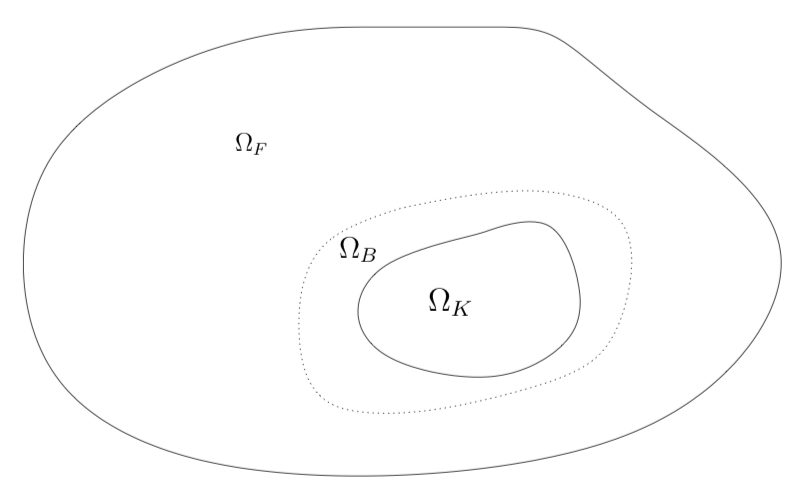

  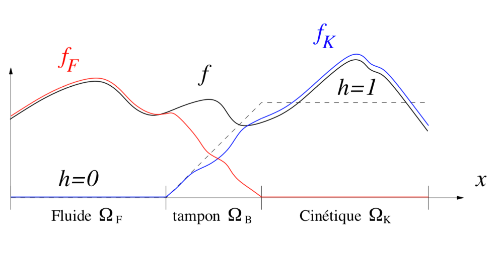

  Illustration de la décomposition de domaine spatial à l'aide d'une fonction de transition $h(x)$. 

Utiliser une fonction de transition $h$ continument dérivable permet d’éviter une rupture de modèle et de ne pas avoir à introduire des conditions aux bords entre le modèle fluide et cinétique comme dans [@jcp2005]. En outre, les approches de décomposition de domaine classiques qui nécessitent une interface entre le domaine fluide et cinétique dont la gestion numérique peut s'avérer très difficile. Nous obtenons donc une zone de transition des modèles où la solution calculée est une superposition des deux solutions, pondérée par la valeur de $h$. Nous allons pouvoir définir\ :

$$
  g = hg + (1-h)g = g_K + g_F
$$

où $g_K=hg$ correspond à la perturbation par rapport à l'équilibre maxwellien dans $\Omega_K$, et $g_F = (1-h)g$ dans $\Omega_F$. Dans $\Omega_F$ on suppose que le système est proche de l'équilibre $f \approx \mathcal{M}_{[U]}$, par conséquent la grandeur $g_F$ pourra être négligée.

Tentons d'exploiter cette hypothèse dans le modèle *micro-macro* ([!eq:mM]), reprenons le modèle *micro* que nous multiplions par $h$\ :

$$
  \underbrace{h\partial_t g}_{(1)} + \underbrace{h(I-\Pi)(\mathcal{T}_{v,E}\mathcal{M}_{[U]})}_{(2)} + \underbrace{h(I-\Pi)(\mathcal{T}_{v,E}(g_K+g_F))}_{(3)} = -\frac{h}{\varepsilon}g
$$

1. On a $\partial_t g_k = \partial_t(hg) = h\partial_t g - g\partial_t h$ ; donc $h\partial_t g = \partial_t g_K - g\partial_t h$ ;
2. Le second terme ne dépend pas de $g$, on le passe donc dans le membre de droite.
3. On distingue ce terme en deux parties, entre l'opérateur identité et le projecteur $\Pi$, ce second terme ira dans le membre de droite.

D’où\ :

$$
  \begin{aligned}
    \partial_t g_K + h\mathcal{T}_{v,E}(g_K) + h\mathcal{T}_{v,E}(g_F) &= \\
     -\frac{1}{\varepsilon}g_K + \frac{g_K}{h}\partial_t h - h(I-\Pi)&(\mathcal{T}_{v,E}\mathcal{M}_{[U]}) + h\Pi(\mathcal{T}_{v,E}(g_K+g_F))
  \end{aligned}
$${#eq:mMh:gF}

P. Degond, G. Dimarco et L. Mieussens proposent dans [@dimarco] une simplification du terme $- h(I-\Pi)(\mathcal{T}_{v,E}\mathcal{M}_{[U]}) + h\Pi(\mathcal{T}_{v,E}(g_K+g_F))$ pour ne l'exprimer qu'en fonction de la distribution maxwellienne $\mathcal{M}_{[U]}$. Pour cela il est nécessaire de reprendre le modèle *macro* ([!eq:mima:macro]), qui en décomposant $f=\mathcal{M}_{[U]} + g$ permet d'exprimer $\partial_t\mathcal{M}_{[U]}$\ :

$$
  \partial_t\mathcal{M}_{[U]} = - \partial_t g - \frac{1}{\varepsilon}g - \mathcal{T}_{v,E}(\mathcal{M}_{[U]}+g)
$$

Le modèle *micro* ([!eq:mima:micro]) quant à lui nous donne une expression pour $\partial_t g$\ :

$$
  -\partial_t g = \frac{1}{\varepsilon}g +(I-\Pi)(\mathcal{T}_{v,E}(\mathcal{M}_{[U]}+g))
$$

Ainsi $\partial_t\mathcal{M}_{[U]}$ peut s'exprimer comme suit\ :

$$
  \partial_t\mathcal{M}_{[U]} = -\Pi(\mathcal{T}_{v,E}(\mathcal{M}_{[U]}+g_K+g_F))
$$

Il devient alors possible de simplifier le dernier terme de ([!eq:mMh:gF]), ce qui mène à la réécriture suivante\ :

$$ 
  \partial_t g_K + h\mathcal{T}_{v,E}(g_K) + h\mathcal{T}_{v,E}(g_F) = -\frac{1}{\varepsilon}g_K + \frac{g_K}{h}\partial_t h - h(\partial_t+\mathcal{T}_{v,E})\mathcal{M}_{[U]}
$$

Cette formulation permet de ne conserver aucune projection de $g_F$ ou $g_K$. Il devient donc plus aisé de travailler sur ces grandeurs que nous souhaitons approximer. Cependant, cela implique numériquement le calcul de l'approximation de $\partial_t \mathcal{M}_{[U]}$ qui est une opération potentiellement coûteuse aussi bien en temps de calcul qu'en utilisation mémoire. Ainsi dans la partie numérique la formulation conservant les projections de $g_K$ sera préférée.

Nous effectuons une approximation par rapport à $g$, en effet la fonction de transition $h$ permet de subdiviser le domaine. Nous négligerons $g_F$ par la suite\ :

$$
  g_F = 0
$$

La partie *micro* du modèle *micro-macro*, après cette approximation devient\ :

$$
  \begin{aligned}
    \partial_t g_K + h\mathcal{T}_{v,E}(g_K) = -\frac{1}{\varepsilon}g_K - h(I-&\Pi)(\mathcal{T}_{v,E} \mathcal{M}_{[U]}) \\
      + h&\Pi(\mathcal{T}_{v,E}(g_K)) + \frac{g_K}{h}\partial_t h
  \end{aligned}
$${#eq:mM:h}

Ce modèle sur $g_K$ sera couplé au modèle *macro* qui lui n'est pas modifié.

# Présentation des schémas

On se limitera dans cette partie à l'étude du problème unidimensionnel : $d=1$.

Dans cette partie, nous allons présenter différents schémas numériques pour résoudre le modèle *micro-macro* ([!eq:mM]) et sa version approximée ([!eq:mM:h]). Ce modèle comporte plusieurs difficultés qui devront être surmontées :

* Nous allons chercher des schémas d'ordre élevé en $(x,v)$ pour capturer les forts gradients qui peuvent apparaître selon les conditions initiales. Ces schémas dans l'espace des phases devront aussi fonctionner en multi-dimensions.
* L'opérateur de collision apporte un terme de raideur en $\frac{1}{\varepsilon}$ quand $\varepsilon \to 0$, qui va nécessiter des intégrateurs en temps adaptés.
* Il est bien évidemment nécessaire d'assurer la stabilité du schéma par rapport au terme de transport, les simulations de plasma se faisant souvent en temps long.

## Schémas en temps

Pour étudier la raideur en $\frac{1}{\varepsilon}$, on se propose d'étudier la dynamique temporelle de l'équation différentielle suivante qui contient les mêmes difficultés mais est simplifiée par rapport au modèle *micro-macro* complet\ :

$$
  \begin{cases}
    \frac{\mathrm{d}u}{\mathrm{d}t}(t) = -\frac{1}{\varepsilon}u(t) + L(t,u(t)) \\
    u(0) = u_0
  \end{cases}
$${#eq:edot}

avec $t$ représentant le temps, $u:\mathbb{R}_+\!\to\mathbb{R}$ la fonction inconnue, $\mathcal{F}:\mathbb{R}\to\mathbb{R}$ une fonction donnée régulière, avec comme condition initiale $u_0\in\mathbb{R}$.

On peut résumer la difficulté au cas $\mathcal{F} = 0$ pour étudier la stabilité des schémas temporels, au détriment de quelques paramètres physiques\ :

$$
  \frac{\mathrm{d}u}{\mathrm{d}t} = -\frac{1}{\varepsilon}u
$${#eq:edot2}

où $\varepsilon > 0$ peut être aussi petit que l'on veut. L'enjeu est de construire un schéma temporel uniformément stable par rapport à $\varepsilon \in ]0,1]$.

Une discrétisation en temps de ([!eq:edot2]) nous amènera à calculer une approximation $u^n \approx u(t^n)$, $n\in\mathbb{N}$ où $t^n = n\Delta t$ avec $\Delta t$ notre pas de temps. Ainsi la discrétisation via un schéma d'Euler explicite de ([!eq:edot2]) nous donne\ :

$$
  \frac{u^{n+1}-u^n}{\Delta t} = -\frac{1}{\varepsilon}u^n
$$

soit\ :

$$
  u^n = \left( 1-\frac{\Delta t}{\varepsilon}\right)^n u_0
$$

La solution $(u^n)_n$ reste bornée si et seulement si $| 1-\frac{\Delta t}{\varepsilon} |\leq 1$, *ie* $\Delta t \leq 2\varepsilon$. Or le paramètre $\varepsilon$ peut être choisi arbitrairement petit, donc cette condition est très contraignante et conduit à des temps de calculs trop coûteux. Il est donc impératif d'utiliser un schéma d'Euler implicite de la forme\ :

$$
  \frac{u^{n+1}-u^n}{\Delta t} = -\frac{1}{\varepsilon}u^{n+1}
$$

soit, sous forme itérative\ :

$$
  u^n = \frac{1}{(1+\frac{\Delta t}{\varepsilon})^n}u_0
$$

ce qui est inconditionnellement stable quelle que soit la valeur de $\Delta t$ et de $\varepsilon$. En outre, lorsque $\varepsilon\to 0$ et $\Delta t\to 0$ fixé\ :

$$
  u^n \overset{\varepsilon\to 0}{\to} 0
$$

comme la solution exacte $u(t) = u_0 \exp\left(-\frac{t}{\varepsilon}\right)$. On dit alors que le schéma est *asymptotic preserving*, au sens où la limite quand $\varepsilon$ tend vers $0$ correspond à un schéma consistent avec le modèle asymptotique (qui est le modèle obtenu en passant à la limite $\varepsilon \to 0$ dans ([!eq:edot2])). Par conséquent nous utiliserons un schéma d'Euler implicite en temps pour tester et valider nos différents schémas sur le terme de transport.

### Schéma Runge-Kutta d'ordre 3

Pour des raisons de stabilité, liées à l'utilisation de schémas d'ordre élevé en $x$ (que l'on détaillera plus tard en section [4.3.2](#reformulation-exponentielle-du-modèle-micro)), nous avons été amenés à considérer le schéma de Runge-Kutta d'ordre 3 (RK3).

Le schéma en temps se résout de manière indépendante du schéma d'advection, par conséquent il s'agit d'une simple équation différentielle ordinaire que nous écrirons\ :

$$
  \frac{\mathrm{d}u}{\mathrm{d}t}(t) = L(u(t),t)
$${#eq:rk3:base}

avec $t$ le temps, $u:\mathbb{R}_+\to\mathbb{R}$ la fonction inconnue, $L:\mathbb{R}\times\mathbb{R}_+\to\mathbb{R}$ une fonction dépendant de $u$ et du temps. Nous cherchons à calculer $u^n \approx u(t^n)$, une approximation de $u$ au temps $t^n = n\Delta t$, avec $\Delta t > 0$ le pas de temps. Il existe plusieurs formulations du schéma de Runge-Kutta d'ordre 3. L'ordre 3 nécessite au minimum 3 étapes de calculs, une version ajoutant de la stabilité en 4 étapes existe, ainsi qu'une version utilisant peu de mémoire, décrite dans [@ssp_rk3]. Nous utiliserons le schéma suivant, le plus rapide en temps de calcul\ :

$$
  \begin{aligned}
    u^{(1)} &= u^n + \Delta t L(u^n,t^n) \\
    u^{(2)} &= \frac{3}{4}u^n + \frac{1}{4}u^{(1)} + \frac{1}{4}\Delta t L(u^{(1)},t^n+\Delta t) \\
    u^{n+1} &= \frac{1}{3}u^n + \frac{2}{3}u^{(2)} + \frac{2}{3}\Delta t L(u^{(2)},t^n+\frac{1}{2}\Delta t)
  \end{aligned}
$$

Dans le cadre du modèle *micro-macro* par exemple, nous avons $u=g$ dans la partie *micro* sans terme de collision, $L$ désignant les termes de transport et les termes source.

Si la simulation se concentre sur un plasma peu dense, c'est-à-dire $\varepsilon\to\infty$, le terme raide dans la partie *micro* du modèle *micro-macro* ([!eq:mM]) peut être négligé, d'où\ :

$$
  \partial_t g + (I-\Pi)[\mathcal{T}_{v,E}(\mathcal{M}_{[U]}+g)] = 0
$$

Dans ce cas, nous utilisons ([!eq:rk3:base]) avec $u = g$ et $L(u) = -(I-\Pi)[\mathcal{T}_{v,E}(\mathcal{M}_{[U]}+g)]$. Pour les autres valeurs de $\varepsilon$ il est nécessaire d'effectuer une reformulation de la partie *micro* pour exploiter ce schéma temporel.

## Schémas d'advection d'ordre élevé

Pour approcher le terme de transport $\partial_t g + \mathcal{T}_{v,E}(g)$ de ([!eq:mima:micro]), il est primordial d'utiliser des schémas d'ordre élevé  pour :

* Capturer les forts gradients en diminuant la viscosité numérique ;
* Utiliser moins de points lors de la simulation.

Pour ces raisons nous allons présenter deux schémas d'ordre élevé permettant de résoudre une part de ces problèmes. 

Nous étudierons ces schémas tout d'abord en l'absence de champ électrique $E$. Les transports selon $x$ et $v$ étant indépendants ils peuvent être étudiés séparément. Nous nous ramenons donc à des cas de transport 1D selon $x$. Le transport de $g$ donné par\ :

$$
  \partial_t g + v\partial_x g = 0
$$

se ramène à une équation d'advection linéaire lorsque $v$ est discrétisé par $v_k = k\Delta v$ avec $k\in [\![ -K ,K ]\!]$, $K\in\mathbb{N}$ et $\Delta v > 0$ le pas de vitesse dans l'espace des phases. Ainsi l'exemple de base que nous utiliserons pour présenter ces schémas est une équation d'advection linéaire en une dimension\ :

$$
  \begin{cases}
    \partial_t u + a \partial_x u = 0 \\
    u(t=0,x) = u^0(x)
  \end{cases}
$${#eq:trp:base}

où $t$ est le temps, $x$ la dimension d'espace, $u : \mathbb{R}_+\times\mathbb{R}\to\mathbb{R}$ est la fonction inconnue et la vitesse $a\in\mathbb{R}$. On ajoute à cette équation des conditions aux bords qui dépendront des cas tests présentés.

Nous cherchons à calculer $u^n_i \approx u(t^n,x_i)$ une approximation de $u$ au temps $t^n = n\Delta t$, avec $\Delta t>0$ le pas de temps, en $x_i = i\Delta x$, avec $\Delta x>0$ le pas d'espace.

### Schéma compact

Dans un premier temps nous présenterons uniquement le cas d'un transport à vitesse $a$ constante positive. Un schéma linéaire différences finies avec un *stencil* de taille $r+s+1$ ($r,s\in\mathbb{N}$) peut s'écrire de manière générale comme\ :

$$
  u_i^{n+1} = \sum_{k=-r}^s \gamma_k u_{i+k}^n
$${#eq:df:compact}

où $\gamma_k\in\mathbb{R}$ est un coefficient dépendant du nombre CFL $\nu = a\frac{\Delta t}{\Delta x}$.

On peut réécrire ([!eq:df:compact]) en formulation volumes finis\ :

$$
  u_i^{n+1} = u_i^n - \nu (u^n_{i+\frac{1}{2}} - u^n_{i-\frac{1}{2}})
$$

où $u^n_{i+\frac{1}{2}}$ sont les flux numériques. Le calcul de ces flux est présenté dans [@Boyer:2014aa] pour différents ordres. Nous choisirons ceux d'ordre élevé décrits dans [@despres]. L'ordre du flux dépend du choix du couple $(r,s)$, il est ainsi possible de retrouver plusieurs flux connus\ :

* Le schéma décentré amont, ou *upwind*\ :

  $$
    u_{i+\frac{1}{2}}^n = u_i^n
  $$

* Une combinaison de *Lax-Wendroff* (LW) et de *Beam-Warming* (BW) : $(1-\alpha )LW + \alpha BW$ avec $\alpha = \frac{1+\nu}{3}$\ :

  $$
    u_{i+\frac{1}{2}}^n = u_i^n + \frac{2-\nu}{6}(1-\nu)(u_{i+1}^n-u_{i}^n) + \frac{1+\nu}{6}(1-\nu)(u_i^n-u_{i-1}^n)
  $$

* Dans [@despres], B. Després propose le schéma à 6 points d'ordre 5 suivant\ :

  $$
    \begin{aligned}
      u_{i+\frac{1}{2}}^n = & \ u_{i+2}^n + \frac{\nu+3}{2}(u_{i+1}^n-u_{i+2}^n) + \frac{(2+\nu)(1+\nu)}{6}(u_i^n - 2u_{i+1}^n + u_{i+2}^n) \\
                          & + \frac{(2+\nu)(1+\nu)(\nu-1)}{24}(u_{i-1}^n - 3u_{i}^n + 3u_{i+1}^n - u_{i+2}^n) \\
                          & + \frac{(2+\nu)(1+\nu)(\nu-1)(\nu-2)}{120}(u_{i-2}^n - 4u_{i-1}^n + 6u_{i}^n - 4u_{i+1}^n + u_{i+2}^n)
    \end{aligned}
  $$

C'est ce dernier flux que nous utiliserons par la suite.

L'utilisation d'une vitesse $a$ quelconque s'effectue en suivant le *sens du vent*, c'est-à-dire, en notant\ :

* $a^+ = \max(a,0)$,
* $a^- = \min(a,0)$,

on obtient alors le schéma pour toute vitesse suivant\ :

$$
  u^{n+1}_i = u^n_i - a^+\frac{\Delta t}{\Delta x}(u^n_{i+\frac{1}{2}} - u^n_{i-\frac{1}{2}}) - a^-\frac{\Delta t}{\Delta x}(u^n_{i+\frac{3}{2}}-u^n_{i+\frac{1}{2}})
$$

#### Obtention de l'ordre en espace

La solution exacte d'un problème de transport à vitesse $a$ constante est connue. Nous allons donc partir de ce problème, le résoudre sur un premier maillage et en calculer l'erreur ; puis répéter l'opération sur un maillage plus fin. Les différentes résolutions sur différents maillages s'effectuent toutes jusqu'au même temps final.

Le problème que nous considérons est ([!eq:trp:base]) avec $a=1$\ :

$$
  \partial_t u + \partial_x u = 0 \quad, u(t=0,x) = u_0(x)
$$

L'équation est considérée pour $x\in[0,2\pi]$, avec des conditions aux bords périodiques ; et nous allons considérer un cosinus comme condition initiale\ :

$$
  u_i^0 = \cos(x_i)
$$

avec $x_i = i\Delta x$ et le pas d'espace $\Delta x = \frac{2\pi}{N}$, où $N$ est le nombre de points du maillage. La solution exacte au temps $t^n= n\Delta t$, $n\in\mathbb{N}$, $\Delta t >0$ est\ :

$$
  u(t^n,x_i) = \cos(x_i - t^n)
$$

##### Calcul à pas de temps fixe

Pour être certain de ne pas prendre en compte l'erreur en temps dans le calcul de l'erreur en espace, il est possible de résoudre le problème sur un seul pas de temps toujours identique. Ainsi le seul paramètre modifié d'une simulation à l'autre est le raffinement du maillage et on observera uniquement l'erreur en espace.

Un seul pas de temps suffit pour l'obtention de l'ordre :

$$
  u_i^1 = u_i^0 - \frac{\Delta t}{\Delta x}( u^0_{i+\frac{1}{2}} - u^0_{i-\frac{1}{2}}) = \cos(x_i - \Delta t) + \mathcal{O}(\Delta x^m)
$$

où $m$ est l'ordre recherché. L'erreur se calcule par la norme de la différence de la solution approchée avec la solution exacte. Plus précisément, elle est définie par\ :

$$
  e_1 = \sum_{i=1}^N |u_i^1 - \cos(x_i - \Delta t) |\Delta x
$$

en norme $L^1$, ou

$$
  e_{\infty} =  \sup_{i=1,\dots,N} |u_i^1 - \cos(x_i - \Delta t) |
$$

en norme infinie.

Par définition, un schéma d'ordre $m$ est tel que $e_1 = C\Delta x^m$ ou $e_{\infty} = \tilde{C}\Delta x^m$, donc en traçant l'erreur sur une échelle logarithmique on trouve :

$$
  \log e_1 = \log C + m \log \Delta x
$$

En effectuant cette simulation pour différentes valeurs de $\Delta x$ on peut tracer $\log e_1 = F(\log \Delta x)$, où l'on doit obtenir une droite dont la pente indique l'ordre.

Dans notre cas nous prendrons $\Delta x = \frac{2\pi}{N}$ avec différentes valeurs de $N$ entre $10$ et $200$. Pour assurer notre condition CFL nous choisirons $\Delta t < \frac{2\pi}{200}$ fixé.

La figure 4.1 montre l’erreur en fonction du pas d’espace $\Delta x$ en échelle logarithmique. L'erreur est calculée sur un seul pas de temps $\Delta t = \pi 10^{-6}$. On y mesure, quelle que soit la méthode de calcul de l'erreur (erreur en norme 1 : $e_1$ ou erreur en norme infinie : $e_\infty$) l'ordre à une valeur environ de $5$ (pente en pointillée). Ceci est confirmé par les valeurs numériques données dans le tableau ci-dessous. L'ordre partiel est le coefficient directeur de la droite formée par les 2 précédents points $(\log(\Delta x),\log(e_1))$ avec l'erreur en norme 1. Il permet d'estimer la valeur de l'ordre. L'ordre partiel calculé à partir de l'erreur infinie donne le même ordre de grandeur. On trouve aussi par cette méthode une valeur proche de $5$.

|   N | $\log(\Delta x)$         | $\log(e_1)$             | $\log(e_{\infty})$        | Ordre partiel    |
|-----|--------------------------|-------------------------|---------------------------|------------------|
|  10 |  0.6283185307179586      | 1.8885115323892025E-008 | 4.6439991852054163E-009   |  ---             |
|  20 |  0.3141592653589793      | 6.3343666063889316E-010 | 1.5632262151399345E-010   | 4.89790541666598 |
|  30 |  0.2094395102393195      | 8.3633337412339448E-011 | 2.0870083439206155E-011   | 4.99356851573894 |
|  40 |  0.1570796326794896      | 1.9970045946399870E-011 | 4.9763526632773392E-012   | 4.9784428799281  |
|  50 |  0.1256637061435917      | 6.5414345863822243E-012 | 1.6342482922482304E-012   | 5.00160970143643 |
|  60 |  0.1047197551196597      | 2.6340730808331303E-012 | 6.5758509748548022E-013   | 4.98912561409769 |
|  70 |  8.9759790102565518E-002 | 1.2182339893132100E-012 | 3.0442315335221792E-013   | 5.00243715241308 |
|  80 |  7.8539816339744828E-002 | 6.2539805846059710E-013 | 1.5620837956475953E-013   | 4.9933516428147  |
|  90 |  6.9813170079773182E-002 | 3.4700222375271565E-013 | 8.6708418223224726E-014   | 5.00120538432754 |
| 100 |  6.2831853071795868E-002 | 2.0498639824922264E-013 | 5.1181281435219717E-014   | 4.99606098371577 |
| 110 |  5.7119866428905326E-002 | 1.2722515599787320E-013 | 3.1863400806741993E-014   | 5.00455700829749 |
| 120 |  5.2359877559829883E-002 | 8.2310995826784676E-014 | 2.0650148258027912E-014   | 5.00456041835972 |
| 130 |  4.8332194670612200E-002 | 5.5237440477356868E-014 | 1.3877787807814457E-014   | 4.98313617961912 |
| 140 |  4.4879895051282759E-002 | 3.8176960539761382E-014 | 9.5479180117763462E-015   | 4.98473748123279 |
| 150 |  4.1887902047863905E-002 | 2.6943202835700349E-014 | 6.7723604502134549E-015   | 5.05126322851504 |
| 160 |  3.9269908169872414E-002 | 1.9561511738522877E-014 | 4.9960036108132044E-015   | 4.96086828681551 |
| 170 |  3.6959913571644624E-002 | 1.4410539036993013E-014 | 3.6637359812630166E-015   | 5.04092435136205 |
| 180 |  3.4906585039886591E-002 | 1.0858427052693538E-014 | 2.7755575615628914E-015   | 4.95147314350128 |
| 190 |  3.3069396353576773E-002 | 8.2733617562961384E-015 | 2.1094237467877974E-015   | 5.02893495215468 |
| 200 |  3.1415926535897934E-002 | 6.3763847861952675E-015 | 1.6653345369377348E-015   | 5.07745975149194 |

  : Erreur et ordre sur un seul pas de temps $\Delta t = \pi 10^{-6}$

##### Calcul à nombre de CFL constant

Il est intéressant de faire une simulation sur plusieurs pas de temps pour amplifier la visibilité de l'ordre du schéma ; l’inconvénient est que l'erreur du schéma temporel empêche d'observer l'erreur due au schéma spatial sans choisir un pas de temps arbitrairement très faible. Pour remédier en partie à ce problème nous allons travailler sur un nombre de CFL constant, c'est-à-dire\ :

$$
  \frac{\Delta t}{\Delta x} = c
$$

Ainsi à chaque raffinement de maillage, le pas de temps est aussi raffiné, l'erreur en temps diminue donc de manière similaire.

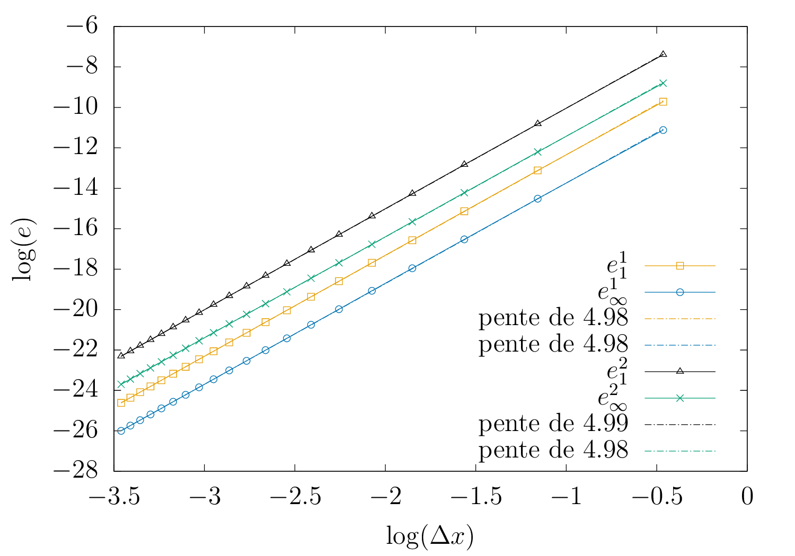

La figure 4.2 montre l'évolution de l'erreur en fonction du pas d'espace $\Delta x$ en échelle logarithmique. L'erreur est indiquée pour 2 temps distincts $t_1= 0.1$ et $t_2 = 1$ pour un nombre de CFL égal à $c = 10^{-4}$. L'erreur infinie, au temps $t_i$, notée $e_\infty^{i}$ est systématiquement plus faible que l'erreur en norme 1, notée $e_1^{i}$, car cette dernière dénote un caractère plus global (somme des erreurs locales). L'écart entre les erreurs au temps $t_1$ et au temps $t_2$ illustre l'erreur du schéma en temps, ici un schéma d'Euler explicite. Les points pour un $\Delta x$ faible, donc à droite de la figure ne permettent pas de calculer convenablement l'ordre du schéma puisqu'il s'agit d'une propriété à la limite quand $\Delta x \to 0$. Ainsi l'ordre mesuré sur la figure à l'aide d'une minimisation (valeur de $4.48$) est faussée par la présence des ces points. Le tableau suivant permet de se donner une idée de l'ordre partiel (calculé au temps $t_1$) et ainsi de la valeur limite pour de faibles valeurs de $\Delta x$. On peut donc affirmer que l'ordre de ce schéma est 5, ce qui est en accord avec le résultat obtenu dans [@siam2013].

|  $N$ |   $\Delta x$  |  $n_1$   |      $e_1^1$  |  $e_\infty^1$  |  $n_2$  |      $e_1^2$  |  $e_\infty^2$ | Ordre partiel |
|------|---------------|----------|---------------|----------------|---------|---------------|---------------|---------------|
|  10  |  0.12566E+01  |    796   |  0.91045E-01  |   0.25373E-01  |   7958  |  0.23402E+01  |   0.48973E+00 |  ---          |
|  20  |  0.62832E+00  |   1592   |  0.16296E-01  |   0.75946E-02  |  15916  |  0.24779E+00  |   0.91331E-01 | 2.46          |
|  30  |  0.41888E+00  |   2388   |  0.30697E-02  |   0.17333E-02  |  23874  |  0.33884E-01  |   0.19089E-01 | 4.11          |
|  40  |  0.31416E+00  |   3184   |  0.86438E-03  |   0.49418E-03  |  31831  |  0.85959E-02  |   0.49384E-02 | 4.40          |
|  50  |  0.25133E+00  |   3979   |  0.29500E-03  |   0.17524E-03  |  39789  |  0.29360E-02  |   0.16277E-02 | 4.81          |
|  60  |  0.20944E+00  |   4775   |  0.12050E-03  |   0.73274E-04  |  47747  |  0.12244E-02  |   0.71686E-03 | 4.91          |
|  70  |  0.17952E+00  |   5571   |  0.57995E-04  |   0.34643E-04  |  55705  |  0.58089E-03  |   0.34831E-03 | 4.74          |
|  80  |  0.15708E+00  |   6367   |  0.29736E-04  |   0.17991E-04  |  63662  |  0.29913E-03  |   0.18170E-03 | 5.00          |
|  90  |  0.13963E+00  |   7162   |  0.16721E-04  |   0.10057E-04  |  71620  |  0.16729E-03  |   0.10091E-03 | 4.88          |
| 100  |  0.12566E+00  |   7958   |  0.98895E-05  |   0.59647E-05  |  79578  |  0.98436E-04  |   0.59142E-04 | 4.98          |
| 110  |  0.11424E+00  |   8754   |  0.62158E-05  |   0.37134E-05  |  87536  |  0.62044E-04  |   0.37481E-04 | 4.87          |
| 120  |  0.10472E+00  |   9550   |  0.40384E-05  |   0.24170E-05  |  95493  |  0.40213E-04  |   0.24571E-04 | 4.95          |
| 130  |  0.96664E-01  |  10346   |  0.27021E-05  |   0.16371E-05  | 103451  |  0.27136E-04  |   0.16534E-04 | 5.01          |
| 140  |  0.89760E-01  |  11141   |  0.18766E-05  |   0.11385E-05  | 111409  |  0.18758E-04  |   0.11398E-04 | 4.91          |
| 150  |  0.83776E-01  |  11937   |  0.13286E-05  |   0.81050E-06  | 119367  |  0.13326E-04  |   0.80321E-05 | 5.00          |
| 160  |  0.78540E-01  |  12733   |  0.96536E-06  |   0.58905E-06  | 127324  |  0.96469E-05  |   0.58736E-05 | 4.94          |
| 170  |  0.73920E-01  |  13529   |  0.71124E-06  |   0.43605E-06  | 135282  |  0.71128E-05  |   0.43599E-05 | 5.03          |
| 180  |  0.69813E-01  |  14324   |  0.53662E-06  |   0.32814E-06  | 143240  |  0.53650E-05  |   0.32804E-05 | 4.92          |
| 190  |  0.66139E-01  |  15120   |  0.41032E-06  |   0.25064E-06  | 151198  |  0.40978E-05  |   0.24997E-05 | 4.96          |
| 200  |  0.62832E-01  |  15916   |  0.31724E-06  |   0.19402E-06  | 159155  |  0.32023E-05  |   0.19290E-05 | 5.01          |
  
  : Erreur et ordre au temps $t_1 = 0.1$ et au temps $t_2 = 1$. La colonne $N$ permet de calculer $\Delta x = \frac{2\pi}{N}$, $n_1$ et $n_2$ sont le nombre d'itérations jusqu'au temps $t_1$ respectivement $t_2$. Les erreurs sont données au temps $t_1$ ($e_1^1$ et $e_\infty^1$) ainsi qu'au temps $t_2$ ($e_1^2$ et $e_\infty^2$) en norme 1 et infinie.

### Schéma WENO

Les schémas numériques d'ordre élevé ont permis d'approfondir l'étude de problèmes complexes comme ceux intervenant en mécanique des fluides. L'introduction de l'ordre élevé se fait généralement au détriment d'oscillations pouvant apparaître au niveau des discontinuités. Une famille de schémas numériques d'ordre élevé a été introduite par C.-W. Shu, exposée dans [@icase] et [@weno], permettant de prévenir l'apparition d'oscillation.

WENO pour *weighted essentially non-oscillatory* est une famille de schémas numériques qui se généralise facilement à l'ordre élevé sans pour autant provoquer d'oscillations. L'idée des schémas WENO est d'effectuer plusieurs interpolations polynomiales lagrangiennes sur des *stencils* incluant le point à évaluer, pondérées pour limiter les oscillations. La méthode que nous allons présenter ici est un schéma WENO d'ordre 5.

Nous présenterons ce schéma toujours à partir de l'équation ([!eq:trp:base]). Le schéma WENO de base s'écrit à partir d'une vitesse $a$ pouvant dépendre de $x$, l'équation de transport s'écrit alors\ :

$$
  \partial_t u + \partial_x(a u) = 0
$$

Dans notre cas, la discrétisation de la vitesse $a$ dépend d'un paramètre $k$ indépendant de $i$ (discrétisation de l'espace des phases), nous noterons par conséquent cette discrétisation $a_k$. Cette notation permettra d'écrire directement le schéma en espace de la partie *micro* en substituant $a_k$ par $v_k$ et $u_{i,k}$ par $g_{i,k}$. Pour alléger les notations, nous nous placerons au temps $t^n$. Nous souhaitons approximer $\partial_x(au)_{|x=x_i,v=v_k}$\ :

$$
  \partial(au)_{|x=x_i,v=v_k} \approx \frac{1}{\Delta x}(\hat{u}_{i+\frac{1}{2},k} - \hat{u}_{i-\frac{1}{2},k})
$$

où $\hat{u}_{i,k}$ est une approximation de $(au)_{i,k}$ et $\hat{u}_{i+\frac{1}{2},k}$ est le flux numérique. Nous allons distinguer les cas $a_k >0$ et $a_k <0$ en écrivant $\hat{u}$ comme :

$$
  \hat{u}_{i,k} = \hat{u}_{i,k}^+ + \hat{u}_{i,k}^-
$$

où :

* $\hat{u}_{i.k}^+ = a^+u_{i,k} = \max(a_k,0)u_{i,k}$
* $\hat{u}_{i.k}^- = a^-u_{i,k} = \min(a_k,0)u_{i,k}$

Chaque flux numérique est donnée par la somme pondérée de 3 approximations sur 3 *stencils* différents :

$$
  \begin{aligned}
    \hat{u}_{i+\frac{1}{2},k}^+ =\,&w_0^+\left(\frac{2}{6}u_{i-2,k}^+ - \frac{7}{6}u_{i-1,k}^+ + \frac{11}{6}u_{i,k}^+\right)
                        +   w_1^+\left(-\frac{1}{6}u_{i-1,k}^+ + \frac{5}{6}u_{i,k}^+   +  \frac{2}{6}u_{i+1,k}^+\right) \\
                        +\,&w_2^+\left( \frac{2}{6}u_{i,k}^+   + \frac{5}{6}u_{i+1,k}^+ -  \frac{1}{6}u_{i+2,k}^+\right)
  \end{aligned}
$$

et

$$
  \begin{aligned}
  \hat{u}_{i+\frac{1}{2},k}^- =\,&w_2^-\left(-\frac{1}{6}u_{i-1,k}^- + \frac{5}{6}u_{i,k}^-   + \frac{2}{6}u_{i+1,k}^-\right)
                        +   w_1^-\left( \frac{2}{6}u_{i,k}^-   + \frac{5}{6}u_{i+1,k}^- - \frac{1}{6}u_{i+2,k}^-\right) \\
                        +\,&w_0^-\left(\frac{11}{6}u_{i+1,k}^- - \frac{7}{6}u_{i+2,k}^- + \frac{2}{6}u_{i+3,k}^-\right)
  \end{aligned}
$$

Les poids non linéaires $w_{n}^{\pm}$ sont des fractions rationnelles données par :

$$
  w_{n}^{\pm} = \frac{\tilde{w}_{n}^{\pm}}{\sum_{m=0}^2 \tilde{w}_{m}^{\pm} } \,, \quad \tilde{w}_{n}^{\pm} = \frac{\gamma_n}{(\epsilon + \beta_{n}^{\pm})^2}
$$

avec les poids linéaires $\gamma_{n}$ donnés par :

$$
  \gamma_{0} = \frac{1}{10} \,, \quad \gamma_{1} = \frac{3}{5}\,,\quad \gamma_{2} = \frac{3}{10}
$$

et les indicateurs de continuités $\beta_n^{\pm}$ donnés par :

$$
 \begin{aligned}
   \beta_0^+ &= \frac{13}{12}(u^+_{i-2,k} -2u^+_{i-1,k} + u^+_{i  ,k})^2 + \frac{1}{4}( u^+_{i-2,k} - 4u^+_{i-1,k} + 3u^+_{i,k})^2 \\
   \beta_1^+ &= \frac{13}{12}(u^+_{i-1,k} -2u^+_{i  ,k} + u^+_{i+1,k})^2 + \frac{1}{4}( u^+_{i-1,k} -  u^+_{i+1,k})^2 \\
   \beta_2^+ &= \frac{13}{12}(u^+_{i  ,k} -2u^+_{i+1,k} + u^+_{i+2,k})^2 + \frac{1}{4}(3u^+_{i  ,k} - 4u^+_{i+1,k} + u^+_{i+2,k} )^2 
 \end{aligned}
$$

et

$$
 \begin{aligned}
   \beta_0^- &= \frac{13}{12}(u^-_{i+1,k} -2u^-_{i+2,k} + u^-_{i+3,k})^2 + \frac{1}{4}(3u^-_{i+1,k} - 4u^-_{i+2,k} + u^-_{i+3,k})^2 \\
   \beta_1^- &= \frac{13}{12}(u^-_{i  ,k} -2u^-_{i+1,k} + u^-_{i+2,k})^2 + \frac{1}{4}(u^-_{i,k} - u^-_{i+2,k})^2 \\
   \beta_2^- &= \frac{13}{12}(u^-_{i-1,k} -2u^-_{i  ,k} + u^-_{i+1,k})^2 + \frac{1}{4}(u^-_{i,k} - 4u^-_{i,k} + 3u^-_{i+1,k})^2
 \end{aligned}
$$

et enfin, $\epsilon$ est un paramètre pour prévenir que le dénominateur soit égal à $0$ ; il est généralement pris à $\epsilon = 10^{-6}$ (dans [@weno]) ou $\epsilon = 10^{-5}\times\max_{i,k}( a^0_k u^0_{i})$ (dans [@qiu]) ; ce dernier cas présente l'avantage de s'adapter à l'amplitude de la fonction à considérer.

On a ainsi définie l'approximation du terme de transport à l'aide d'un schéma WENO pour toute vitesse $a_k$ :

$$
  \partial_x (au)_{|x=x_i,y=y_k} \approx \frac{1}{\Delta x}\left[ (\hat{u}^+_{i+\frac{1}{2},k} - \hat{u}^+_{i-\frac{1}{2},k}) + (\hat{u}^-_{i+\frac{1}{2},k} - \hat{u}^-_{i-\frac{1}{2},k}) \right] 
$$

#### Obtention de l'ordre en espace

Comme précédemment nous allons calculer l'ordre à l'aide du transport à vitesse constante $a$. Nous allons résoudre successivement ce problème de transport sur un maillage de plus en plus fin.

Le problème que nous considérons est ([!eq:trp:base]) avec $a=1$\ :

$$
  \partial_t u + \partial_x u = 0
$$

Un test similaire a été effectué à vitesse négative au vu du changement de formulation pour ce cas. L'équation est considérée valide sur l'ensemble $x\in[0,2\pi]$ avec des conditions aux bords périodiques ; et nous allons considérer un cosinus comme condition initiale\ :

$$
  u_i^0 = \cos(x_i)
$$

avec $x_i = i\Delta x$ et le pas d'espace $\Delta x = \frac{2\pi}{N}$ où $N$ est le nombre de points du maillage. La solution exacte au temps $t^n$ est\ :

$$
  u_i^n = \cos(x_i - t^n)
$$

Pour ce schéma nous utiliserons uniquement la mesure de l'ordre avec un nombre de CFL constant, ce qui permet de réduire l'erreur en temps à mesure que le maillage se raffine.

Les différentes simulations sont effectuées avec un nombre de CFL constant, c'est-à-dire\ :

$$
  \frac{\Delta t}{\Delta x} = c
$$

donc $\Delta t = c\frac{2\pi}{N}$ change à chaque raffinement de maillage.

La figure 4.3 montre l’évolution de l’erreur en fonction du pas d’espace $\Delta x$ en échelle logarithmique. L’erreur est indiquée pour 2 temps distincts $t_1= 0.1$ et $t_2 = 1$ pour un nombre de CFL égal à $c = 10^{-5}$. En comparant ces résultats par rapport à ceux du schéma compact, l'ordre donné via le graphique est plus élevé (on peut déterminer déjà une valeur de $5$). On remarque aussi que l'erreur systématique du schéma est beaucoup plus faible. Ainsi le *plongeon* de l'erreur que l'on peut observer sur les valeurs à gauche est plus dû au bruit de l'erreur machine qu'à un véritable schéma d'ordre $7$ (dernière valeur de l'ordre partiel présent dans le tableau suivant).

| $m$ | $\Delta x$  | $n_1$  | $e_1^1$     | $e_\infty^1$| $n_2$  | $e_1^2$     | $e_\infty^2$|  Ordre partiel     |
|-----|-------------|--------|-------------|-------------|--------|-------------|-------------|--------------------|
| 10  | 0.62832E+00 |   1592 | 0.37995E-05 | 0.13973E-05 |  15916 | 0.37846E-04 | 0.13958E-04 | ---                |
| 20  | 0.31416E+00 |   3184 | 0.17447E-06 | 0.51436E-07 |  31831 | 0.17442E-05 | 0.51362E-06 |   4.44475868534761 |
| 30  | 0.20944E+00 |   4775 | 0.21990E-07 | 0.64814E-08 |  47747 | 0.21986E-06 | 0.64666E-07 |   5.10812141688064 |
| 40  | 0.15708E+00 |   6367 | 0.50685E-08 | 0.15061E-08 |  63662 | 0.50680E-07 | 0.15011E-07 |   5.10126639529244 |
| 50  | 0.12566E+00 |   7958 | 0.16195E-08 | 0.48771E-09 |  79578 | 0.16194E-07 | 0.48569E-08 |   5.11224599339332 |
| 60  | 0.10472E+00 |   9550 | 0.64017E-09 | 0.19434E-09 |  95493 | 0.64014E-08 | 0.19335E-08 |   5.09155944269373 |
| 70  | 0.89760E-01 |  11141 | 0.29164E-09 | 0.89188E-10 | 111409 | 0.29163E-08 | 0.88654E-09 |   5.10029279160139 |
| 80  | 0.78540E-01 |  12733 | 0.14769E-09 | 0.45325E-10 | 127324 | 0.14768E-08 | 0.45101E-09 |   5.09546608574089 |
| 90  | 0.69813E-01 |  14324 | 0.80818E-10 | 0.24858E-10 | 143240 | 0.80816E-09 | 0.24901E-09 |   5.11866013879769 |
|100  | 0.62832E-01 |  15916 | 0.47041E-10 | 0.14550E-10 | 159155 | 0.47040E-09 | 0.14591E-09 |   5.13669351040521 |
|110  | 0.57120E-01 |  17508 | 0.28707E-10 | 0.89342E-11 | 175071 | 0.28705E-09 | 0.89616E-10 |   5.18180290307426 |
|120  | 0.52360E-01 |  19099 | 0.18209E-10 | 0.56994E-11 | 190986 | 0.18208E-09 | 0.57143E-10 |   5.23178731178777 |
|130  | 0.48332E-01 |  20691 | 0.11900E-10 | 0.37434E-11 | 206902 | 0.11899E-09 | 0.37558E-10 |   5.31396000767932 |
|140  | 0.44880E-01 |  22282 | 0.79686E-11 | 0.25192E-11 | 222817 | 0.79671E-10 | 0.25277E-10 |   5.4118878574993  |
|150  | 0.41888E-01 |  23874 | 0.54306E-11 | 0.17266E-11 | 238733 | 0.54306E-10 | 0.17326E-10 |   5.55795381912175 |
|160  | 0.39270E-01 |  25465 | 0.37499E-11 | 0.11992E-11 | 254648 | 0.37501E-10 | 0.12037E-10 |   5.73797548489796 |
|170  | 0.36960E-01 |  27057 | 0.26084E-11 | 0.84055E-12 | 270564 | 0.26079E-10 | 0.84339E-11 |   5.98753700307258 |
|180  | 0.34907E-01 |  28648 | 0.18182E-11 | 0.59053E-12 | 286479 | 0.18181E-10 | 0.59238E-11 |   6.31491121102708 |
|190  | 0.33069E-01 |  30240 | 0.12607E-11 | 0.41400E-12 | 302395 | 0.12602E-10 | 0.41499E-11 |   6.76968883229296 |
|200  | 0.31416E-01 |  31831 | 0.86049E-12 | 0.28710E-12 | 318310 | 0.86084E-11 | 0.28748E-11 |   7.44789538520894 |

  : Erreur et ordre au temps $t_1 = 0.1$ et au temps $t_2 = 1$. La colonne $N$ permet de calculer $\Delta x = \frac{2\pi}{N}$, $n_1$ et $n_2$ sont le nombre d'itérations jusqu'au temps $t_1$ respectivement $t_2$. Les erreurs sont données au temps $t_1$ ($e_1^1$ et $e_\infty^1$) ainsi qu'au temps $t_2$ ($e_1^2$ et $e_\infty^2$) en norme 1 et infinie.

Un des intérêts des schémas WENO est qu'ils se généralisent facilement au cas multi-dimensionnel. En effet, le passage aux dimensions supérieures à $1$ s'effectue par addition des différentes approximations des dérivées dans chaque direction.

Il est donc intéressant d'étudier des cas de transports en 2 dimensions\ :

$$
  \partial_t u + a \partial_x u + b \partial_y u = 0
$$

où $x$ et $y$ sont les deux directions de l'espace, dans lequel nous effectuons un transport à vitesse $a$ dans la direction $x$ et $b$ selon $y$. La solution exacte est connue pour plusieurs cas tests tels que la translation en 2 dimensions (avec $a$ et $b$ des constantes), ou pour le cas d'une rotation (avec $a(x,y)=y$ et $b(x,y)=-x$).

#### Problème d'instabilité

R. Wang et R. Spiteri démontrent dans [@weno_time] que l'utilisation conjointe du schéma WENO d'ordre 5 avec un schéma temporel de type d'Euler explicite est instable. Nous confirmons ce résultat numériquement avec la rotation d'une gaussienne en temps long. On remarque qu'une discrétisation en temps de Runge-Kutta d'ordre 3 stabilise le schéma. C'est cette instabilité qui nous a conduit à utiliser un nombre de CFL arbitrairement très petit $c=10^{-5}$ dans le test 1D.

Nous illustrons ce résultat à l'aide d'un test effectuée en 2D sur un domaine périodiques. Il s'agit d'étudier le comportement d'une gaussienne en rotation autour du centre du domaine.

$$
  \partial_t u + y\partial_x u -x\partial_y u = 0
$$

avec comme condition initiale\ :

$$
  u(t=0,x) = e^{ -\frac{(x-\mu_x)^2}{2\sigma_x} - \frac{(y-\mu_y)^2}{2\sigma_y} } 
$$

| $\mu_x$ | $\sigma_x$ | $\mu_y$ | $\sigma_y$ |
|---------|------------|---------|------------|
| 0.1     | 0.05       | 0       | 0.025      |

La simulation se fait sur le domaine périodique $\Omega = [-1,1]\times [-1,1]$, jusqu'au temps $T_f = 15$. La grille est de dimension $70\times 70$ et nous choisissons $\Delta t = 0.3\Delta x$.

  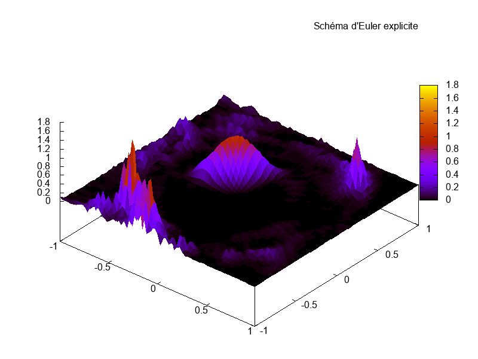

  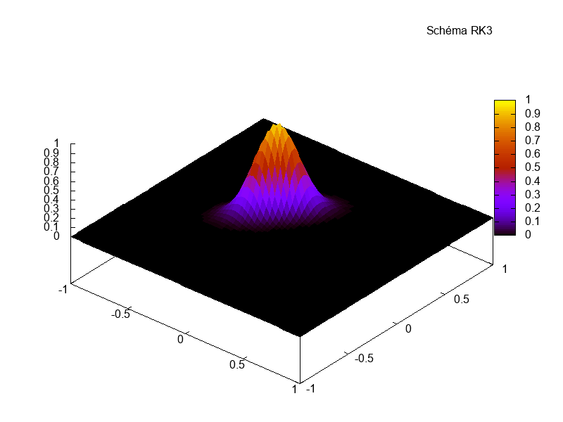

  Comparaison du schéma en temps sur la stabilité des résultats.

On remarque sur la figure 4.4 que le schéma d'Euler explicite provoque des instabilités lors de simulations en temps long, instabilités non présentes avec le schéma de Runge-Kutta d'ordre 3 (RK3).

L'instabilité du couplage WENO-Euler explicite peut être contrôlé à l'aide d'un pas de temps $\Delta t$ plus faible. Ce comportement n'est pas contrôlable dans le cas de simulations en temps long (qui demandent alors un pas de temps beaucoup trop faible).

#### Test de viscosité

À partir du cas test de la rotation avec des conditions aux bords périodiques\ :

$$
  \partial_t u + y\partial_x u -x\partial_y u = 0
$$

il est possible de mettre à l'épreuve la viscosité numérique du schéma. C'est ce qui est effectué dans [@qiu2011], avec 6 rotations d'une condition initiale discontinue.

Ce test se base sur une condition initiale discontinue, présentant aussi des irrégularités à l'aide d'un cylindre tronqué et d'un cône (voir figure 4.5), que l'on fait tourner 6 fois sur lui même (temps final de la simulation $T_f = 12\pi$). La solution exacte est donc la condition initiale. Il s'agit ici de vérifier le comportement du schéma en espace face à des discontinuités et d'observer la viscosité numérique. Le schéma en temps est celui de Runge-Kutta d'ordre 3.

  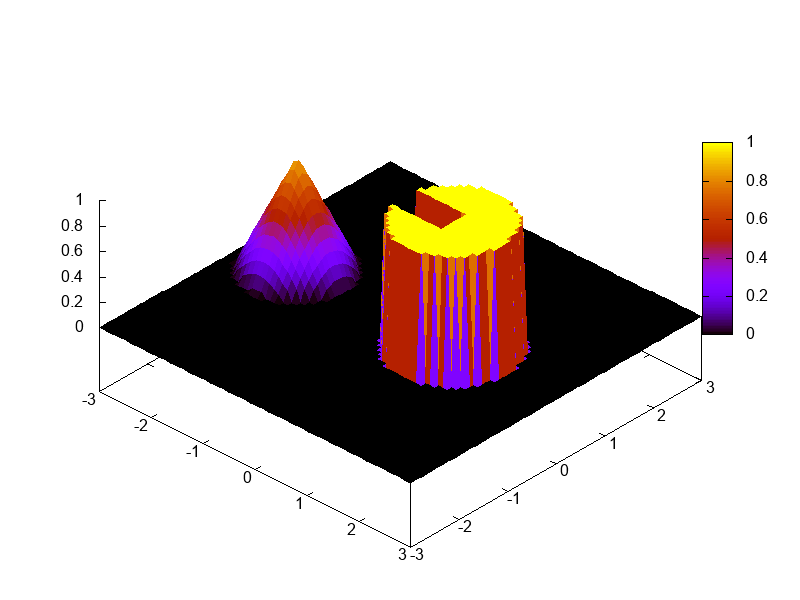
  
  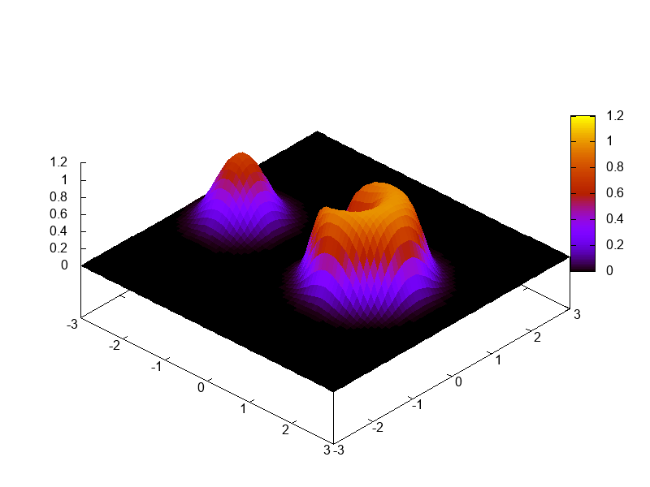

  Test de viscosité sur une condition initiale irrégulière

## Couplage de l'équation de transport et du terme de raideur

Dans cette section, on applique les schémas précédents au modèle *micro-macro*, ce qui va amener à des études supplémentaires comme le calcul de la condition de CFL, ou la reformulation exponentielle du modèle.

### Calcul de la condition CFL

Le terme raide, apporté par l'opérateur de collision BGK va induire une modification de la condition CFL habituelle lors du couplage du schéma d'Euler implicite-explicite avec un schéma en espace.

Pour calculer le nombre de CFL nous allons dans un premier temps nous intéresser au modèle cinétique ([!eq:cine:bgk]) avec $Q(f) = \frac{1}{\varepsilon}(\mathcal{M}_{[U]}-f)$, la description microscopique du modèle *micro-macro* est similaire et implique la même condition. Nous utiliserons le schéma d'Euler implicite pour la discrétisation en temps de $Q(f)$, et pour simplifier les notations nous n'utiliserons qu'un schéma *upwind* en espace, encore une fois le champ électrique est négligé dans cette partie.

$$
  \frac{f_{j,k}^{n+1}-f_{j,k}^n}{\Delta t} + v_k\frac{f_{j+\frac{1}{2},k}^n - f_{j-\frac{1}{2},k}^n}{\Delta x} = \frac{1}{\varepsilon}((\mathcal{M}_{[U^{n+1}]})_{j,k} - f_{j,k}^{n+1})
$$

Le calcul de $\mathcal{M}_{[U^{n+1}]}$ sera explicité dans la section [5.1](#discrétisation-du-modèle-cinétique). Cette équation peut se réécrire, pour une interprétation itérative\ :

$$
  f_{j,k}^{n+1} = \frac{1}{1+\frac{\Delta t}{\varepsilon}}\left[ f_{j,k}^n - v_k\frac{\Delta t}{\Delta x}(f_{j+\frac{1}{2},k}^n - f_{j-\frac{1}{2},k}^n) + \frac{\Delta t}{\varepsilon}(\mathcal{M}_{[U^{n+1}]})_{j,k} \right]
$$

Nous allons utiliser l’analyse de von Neumann pour déterminer la condition CFL, méthode décrite dans [@anm1966]. Cette méthode implique le calcul d'une transformée de Fourier discrète, nous nous plaçons donc dans l'intervalle $\Omega = [0,2\pi]$ avec des conditions aux bords périodiques, c'est-à-dire $f(t,x+2\pi,v) = f(t,x,v)\,\forall t,x,v$. Puisque les fonctions formant la base de la transformée de Fourier sont orthogonales, nous pouvons nous intéresser au comportement de chaque mode $\kappa\in\mathbb{Z}$ indépendamment, puis majorer l'ensemble des modes pour étudier le comportement global.

Le coefficient de Fourier du mode $\kappa$ de $f_{j,k}^n$ est donné par\ :

$$
  \mathfrak{f}_{j,k}^n(\kappa) = e^{i\kappa j\Delta x}A^n_k(\kappa)
$$

où les $\mathfrak{f}_{j,k}(\kappa)$ vérifient\ :

$$
  f_{j,k}^n = \sum_{\kappa\in\mathbb{Z}} \mathfrak{f}_{j,k}^n(\kappa)
$$

où $i$ est le nombre imaginaire tel que $i^2 = -1$. Nous pouvons donc facilement exprimer $\mathfrak{f}_{j-1,k}^n(\kappa)$ directement en fonction de $\mathfrak{f}_{j,k}^n(\kappa)$\ :

$$
  \mathfrak{f}_{j-1,k}^n(\kappa) = e^{i\kappa (j-1)\Delta x}A^n_k(\kappa) = \mathfrak{f}_{j,k}^n(\kappa) e^{-i\kappa\Delta x}
$$

Cela permet donc d’exprimer $\mathfrak{f}_{j,k}^{n+1}(\kappa)$ en fonction uniquement de $\mathfrak{f}_{j,k}^n(\kappa)$, et donc d’obtenir une formule de récurrence du type\ :

$$
  \mathfrak{f}_{j,k}^{n+1}(\kappa) = \mathcal{A} \mathfrak{f}_{j,k}^n(\kappa) = (\mathcal{A})^{n+1} \mathfrak{f}_{j,k}^0(\kappa)
$$

où $\mathcal{A}$ est appelé coefficient d'amplification. On remarque qu’il est nécessaire pour que le schéma soit stable dans $L^2$ d’avoir $|\mathcal{A}| \leq 1$. Pour trouver cette formule de récurrence nous travaillerons sur une version simplifiée du schéma en négligeant l’impact de la maxwellienne.

On part ainsi du schéma simplifié sur chaque mode $\kappa$ de $f$\ :

$$
  \mathfrak{f}_{j,k}^{n+1}(\kappa) = \frac{\varepsilon}{\varepsilon + \Delta t}\left[ \mathfrak{f}_{j,k}^n(\kappa) - \frac{\Delta t}{\Delta x}v_k(\mathfrak{f}_{j,k}^n(\kappa) - \mathfrak{f}_{j,k}^n(\kappa)e^{-i\kappa\Delta x} )  \right]
$$

Ce que l’on peut écrire sous la forme\ :

$$
  \mathfrak{f}_{j,k}^{n+1}(\kappa) = \mathfrak{f}_{j,k}^n(\kappa)\frac{\varepsilon}{\varepsilon + \Delta t}\left[ 1-\frac{\Delta t}{\Delta x}v_k(1-e^{-i\kappa\Delta x}) \right]
$$

On obtient bien la forme désirée $\mathfrak{f}_{j,k}^{n+1}(\kappa) = \mathcal{A} \mathfrak{f}_{j,k}(\kappa)$. Pour simplifier l’étude de $\mathcal{A}$ écrivons ce terme sous la forme\ :

$$
  \mathcal{A} = \frac{\varepsilon}{\varepsilon + \Delta t} \mathcal{B}
$$

Étudions $|\mathcal{B}|^2$\ :

* $\mathrm{Im}(\mathcal{B}) = -\frac{\Delta t}{\Delta x}v_k\sin(\kappa \Delta x)$
* $\mathrm{Re}(\mathcal{B}) = 1-\frac{\Delta t}{\Delta x}v_k(1-\cos(\kappa \Delta x))$

D’où\ :

$$
  \begin{aligned}
    |\mathcal{B}|^2 &= \mathrm{Re}(\mathcal{B})^2 + \mathrm{Im}(\mathcal{B})^2 \\
                    &= 1 + 2(1-\cos(\kappa\Delta x))\Delta t \left[ \frac{\Delta t}{\Delta x^2}v_k^2 - \frac{v_k}{\Delta x}\right] \\
  \end{aligned}
$$

On souhaite $|\mathcal{A}|^2 = \left(\frac{\varepsilon}{\varepsilon + \Delta t}\right)^2|\mathcal{B}|^2 \leq 1$ c’est-à-dire\ :

$$
  |\mathcal{B}|^2 \leq \left(\frac{\varepsilon + \Delta t}{\varepsilon}\right)^2
$$

soit\ :

$$
  1 + 2(1-\cos(\kappa\Delta x))\Delta t \left[ \frac{\Delta t}{\Delta x^2}v_k^2 - \frac{v_k}{\Delta x} \right] \leq 1 + \Delta t \frac{(2\varepsilon + \Delta t)}{\varepsilon^2}
$$

Ce que l’on peut reformuler comme suit, pour majorer $\Delta t$\ :

$$
    \Delta t \left[(1-\cos(\kappa\Delta x))\frac{v_k^2}{\Delta x^2} - \frac{1}{2\varepsilon^2}\right] \leq \frac{1}{\varepsilon} + (1-\cos(\kappa\Delta x))\frac{v_k}{\Delta x}
$$

Cette inégalité doit être vérifiée pour toute vitesse $v_k$, nous allons donc majorer par $v_{\text{max}}$, de même quel que soit le nombre d’onde $\kappa$ nous allons donc majorer $1-\cos(\kappa\Delta x)=2\sin^2(\frac{\kappa\Delta x}{2})$ par 2. Ce qui nous donne après simplification\ :

$$
  \Delta t (2v_{\text{max}}\varepsilon - \Delta x) \leq 2\Delta x \varepsilon
$$

Il est nécessaire d’étudier le signe de $2v_{\text{max}}\varepsilon - \Delta x$\ :

* $2v_{\text{max}}\varepsilon - \Delta x < 0$ alors $\Delta t >0$ ce qui est toujours vérifié. Cette condition est vérifiée si\ :
  
  $$
    \varepsilon < \frac{\Delta x}{2v_{\text{max}}}
  $$

  Avec classiquement $\Delta x \sim 10^{-2}$ et $v_{\text{max}}\sim 18$ ce qui nous donne $\varepsilon \sim 10^{-3}$.
* $2v_{\text{max}}\varepsilon - \Delta x > 0$ alors le schéma sera stable pour\ :

  $$
    \Delta t \leq \frac{2\Delta x \varepsilon}{2v_{\text{max}}\varepsilon - \Delta x}
  $$

En étudiant la fonction\ :

$$
  \mathscr{C}:\varepsilon\mapsto\frac{ \frac{\Delta x}{v_{\text{max}}} \varepsilon}{\varepsilon - \frac{1}{2}\frac{\Delta x}{v_{\text{max}}}}
$$

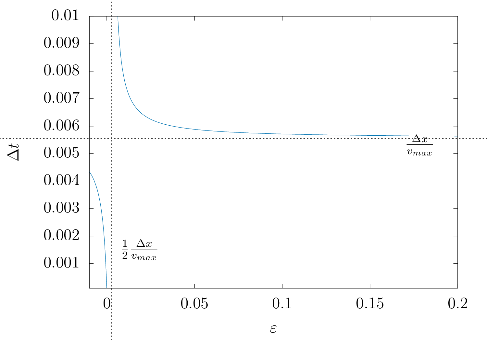

on trouve que cette fonction est décroissante et a pour limite $\frac{\Delta x}{v_{\text{max}}}$, nous utiliserons donc une fraction de cette limite comme base de temps. On retrouve aussi le pôle $\frac{\Delta x}{2v_{\text{max}}}$ qui correspond au changement de condition pour obtenir $\Delta t$.

### Reformulation exponentielle du modèle *micro*

Au sein du modèle *micro-macro* ([!eq:mM]), la partie *micro* fait intervenir un terme de collision : $\frac{1}{\varepsilon}g$, ce terme empêche d'utiliser directement une autre discrétisation en temps que le schéma Euler implicite ou explicite. Or en proposant de l'ordre élevé en espace il devient intéressant, voire indispensable, de monter l'ordre en temps. En effet R. Wang et R. Spiteri démontrent dans [@weno_time] qu'il est impossible de satisfaire la condition CFL d'un schéma composé d'une partie spatiale résolue par un schéma WENO d'ordre 5, et d'une partie temporelle résolue par un schéma d'Euler explicite. Le terme raide en $\frac{1}{\varepsilon}$ ne permet pas de revenir à un cas stable. Il est nécessaire de modifier la formulation du modèle *micro* pour faire intervenir une discrétisation du schéma de Runge-Kutta d'ordre au moins 3 (RK3).

Nous rappelons le modèle *micro* :

$$
  \partial_t g + (I-\Pi)(v\partial_x(\mathcal{M}_{[U]}+g) + E\partial_v(\mathcal{M}_{[U]}+g)) = -\frac{1}{\varepsilon}g
$${#eq:rk3:micro0}

En remarquant que :

$$
  \partial_t g+\frac{1}{\varepsilon}g = e^{-\frac{t}{\varepsilon}}\partial_t\left(e^{\frac{t}{\varepsilon}}g\right)
$$

On pose $\zeta = e^{\frac{t}{\varepsilon}}g$, l'équation ([!eq:rk3:micro0]) devient donc :

$$
  \partial_t \zeta +(I-\Pi)(v\partial_x(\zeta+e^{\frac{t}{\varepsilon}}\mathcal{M}_{[U]})+E\partial_v(\zeta+e^{\frac{t}{\varepsilon}}\mathcal{M}_{[U]})) = 0
$$

Il devient donc possible d'appliquer une discrétisation type Runge-Kutta d'ordre 3, avec :

$$
  L(u,t) = -(I-\Pi)(v\partial_x(u+e^{\frac{t}{\varepsilon}}\mathcal{M}_{[U]})+E\partial_v(u+e^{\frac{t}{\varepsilon}}\mathcal{M}_{[U]}))
$$

Ceci revient à utiliser les schémas dits de Lawson [@siam1967].

## Résolution des équations d'Euler

Le modèle *micro-macro* impose la résolution des équations d'Euler modifiées. Nous allons présenter ici la résolution proposée dans [@dimarco], adaptée à un code de simulation des équations d'Euler déjà existant. La méthode présentée utilise un flux de Lax-Friedrichs avec un limiteur de pente de van Leer symétrique. La discrétisation des équations d'Euler ([!eq:euler]) s'écrit\ :

$$
  U_i^{n+1} = U_i^n - \frac{\Delta t}{\Delta x}(\mathcal{F}_{i+\frac{1}{2}}^n - \mathcal{F}_{i-\frac{1}{2}}^n)
$$

où la grandeur calculée $U_i^n$ est une approximation de $U(t^n,x_i)$ au temps $t^n = n\Delta t$ en $x_i = i\Delta x$. Le flux numérique $\mathcal{F}_{i+\frac{1}{2}}^n$ est donné par\ :

$$
  \mathcal{F}_{i+\frac{1}{2}}^n = \frac{1}{2}(\mathcal{F}(U^n_{i}) + \mathcal{F}(U^n_{i+1})) -\frac{1}{2}\lambda(U_{i+1}^n - U_i^n)) + \frac{1}{4}(\sigma_i^{n,+} - \sigma_{i+1}^{n,-})
$${#eq:euler:flux}

où\ :

* $\mathcal{F}$ est la fonction du modèle d’Euler est donné par\ :

  $$
    \mathcal{F}:U=\begin{pmatrix}\rho \\ \rho u \\ e\end{pmatrix} \mapsto \mathcal{F}(U) = \begin{pmatrix} \rho u \\ \rho u^2 + p \\ eu + pu \end{pmatrix}
  $$

  où $p=2e-\rho u^2$ est la pression.
* $\sigma_i^{n,\pm}$ est un terme correcteur de second ordre, notons $\eta_i^{n,\pm} = \mathcal{F}(U_i^n)\pm\lambda U_i^n$\ :

  $$
    \sigma_i^{n,\pm} = ( \eta_i^{n,\pm} - \eta_{i-1}^{n,\pm} )\phi(\chi_i^{n,\pm})
  $$

  avec $\phi$ la fonction de limiteur de pente de van Leer symétrique donnée par :

  $$
    \phi:x\mapsto \frac{|x|+x}{1+|x|}
  $$

  fonction que l’on applique à $\chi_i^{n,\pm}$ donné par :
  $$
    \chi_i^{n,\pm} = \frac{\eta_i^{n,\pm} - \eta_{i-1}^{n,\pm}}{\eta_{i+1}^{n,\pm} - \eta_i^{n,\pm}}
  $$

* $\lambda$ est la plus grande valeur propre du système d’Euler.

## Résolution du problème de Poisson

Pour résoudre le problème de Poisson en condition aux bords périodiques nous utiliserons une méthode spectrale. Le champ électrique est une fonction de la densité $\rho(t^n,x)$, il est donc nécessaire de résoudre le problème de Poisson à chaque pas de temps, et à chaque sous-étape dans le cas du schéma RK3.

Notons $\varrho = \rho -1$, il suffit de calculer la transformée de Fourier de $\varrho$ pour résoudre le problème ([!eq:cine:poisson]) dans le contexte spectral\ :

$$
  i\kappa \hat{E}_{\kappa} = \hat{\varrho}_{\kappa}
$$

où $\kappa$ est l'indice du coefficient de Fourier et $i$ le nombre complexe tel que $i^2 = -1$. Ainsi on définit pour tout $\kappa$ le coefficient de Fourier\ :

* $\hat{E}_{\kappa} = -i\displaystyle\frac{\hat{\varrho}_{\kappa}}{\kappa}$ si $\kappa \neq 0$
* $\hat{E}_0 = 0$ car $E$ est à moyenne nulle d'après la condition ([!eq:cine:vp])

Ainsi tous les coefficients de Fourier de $E$ sont calculés, il suffit d'effectuer la transformée inverse pour trouver le résultat souhaité.

# Application aux modèles cinétiques et *micro-macro*

Nous avons appliqué les schémas précédents à différents modèles :

* Un modèle cinétique sur $f$ ([!eq:cine]) qui permettra de tester nos schémas sans couplage avec des équations de type Euler.
* Le modèle *micro-macro* ([!eq:mM]) qui couple la discrétisation de la partie cinétique *micro* à la partie fluide de type Euler.
* Le modèle *micro-macro* avec une fonction $h$ qui permettra de tester cette nouvelle modélisation.
* Le modèle fluide d'Euler qui permettra de valider les modèles précédents à la limite $\varepsilon \ll 1$.

## Discrétisation du modèle cinétique

Dans un premier temps, pour pouvoir comparer les résultats avec un code de simulation des équations d'Euler ([!eq:euler]), on étudie le modèle sans champ électrique $E$, c'est-à-dire le modèle suivant\ :

$$
  \partial_t f + v\partial_x f = \frac{1}{\varepsilon}(\mathcal{M}_{[U]}-f)
$$

La résolution nécessite une grille en espace et en vitesse, c'est-à-dire un maillage de l'espace des phases. On note $f_{i,k}^n$ l'approximation de $f(t^n,x_i,v_k)$, avec $t^n = n\Delta t$, $x_i = i\Delta x$, $v_k = v_{\text{min}} + k\Delta v$ avec $n,i,k\in\mathbb{N}$, $\Delta t$, $\Delta x$, $\Delta v>0$ les pas de temps, d'espace et de vitesse. On suppose $f_{i,k}^n$ donnée, le calcul de la nouvelle itération s'effectue schématiquement comme suit\ :

1. On calcule le flux numérique $f_{i+\frac{1}{2},k}^n$ du schéma en espace souhaité (*upwind*, schéma compact ou WENO)\ :

  $$
    f_{i+\frac{1}{2},k}^n \gets ((f_{j,k}^n)_{j\in[i-2;i+2]},v_k)
  $$

2. On calcule le flux numérique $F_{i+\frac{1}{2}}^n$ pour le schéma macro sur $U$ à partir du flux $f_{i+\frac{1}{2},k}^n$\ :
  
  $$
    F_{i+\frac{1}{2}}^n \gets \sum_k v_k m_k f_{i+\frac{1}{2},k}^n\Delta v
  $$

  où $m_k = m(v_k) = (1,v_k,|v_k|^2)^{\textsf{T}}$.

3. On résout le schéma sur $U$\ :
  
  $$
    U_i^{n+1} \gets U_i^n - \frac{\Delta t}{\Delta x}(F_{i+\frac{1}{2}}^n - F_{i-\frac{1}{2}}^n)
  $$

4. On calcule les variables intensives $(\rho_i^{n+1},u_i^{n+1},T_i^{n+1})$\ :

  $$
    \begin{pmatrix}
      \rho^{n+1}_i \\
      u^{n+1}_i \\
      T^{n+1}_i
    \end{pmatrix}
    =
    \begin{pmatrix}
      U_1             \\
      \frac{U_2}{U_1} \\
      \frac{U_3}{U_1} - \left(\frac{U_2}{U_1}\right)^2
    \end{pmatrix}^{n+1}_i
  $$

  où $U=(U_1,U_2,U_3)^{\mathsf{T}} = (\rho,\rho u, \rho u^2 + \rho T)^{\mathsf{T}}$.

5. On calcule la maxwellienne $(\mathcal{M}_{[U^{n+1}]})_{i,k}$ en tout point $(i,k)$ de l’espace des phases\ :

  $$
    (\mathcal{M}_{[U^{n+1}]})_{i,k} = \frac{\rho_i^{n+1}}{\sqrt{2\pi T^{n+1}_i}}\exp\left(-\frac{1}{2}\frac{|v_k - u_i^{n+1} |^2}{T^{n+1}_i} \right)
  $${#eq:max:numcal}

6. On calcule $f^{n+1}_{i,k}$ via le schéma avec le terme de transport et de collision\ :
  
  $$
    f^{n+1}_{i,k} = \frac{1}{1+\frac{\Delta t}{\varepsilon}} \left[ f^n_{i,k} - \frac{\Delta t}{\Delta x}v_k (f^n_{i+\frac{1}{2},k} - f^n_{i-\frac{1}{2},k}) +\frac{\Delta t}{\varepsilon}(\mathcal{M}_{[U^{n+1}]})_{i,k}  \right]
  $$

7. On corrige l’approximation $U_i^{n+1}$ via le calcul du moment de $f^{n+1}_{i,\cdot}$ :

  $$
    U_i^{n+1} \gets \sum_k m_k f_{i,k}^{n+1} \Delta v
  $$

  Dans l'étape 3, la valeur prédite de $U_i^{n+1}$ n'est pas égale aux moments de $f$ : $\sum_k m_k f_{i,k}^{n+1}\Delta v$ à cause de la discrétisation de la vitesse. Cette valeur est donc corrigée à la fin de l'itération.

### Propriété sur la température

Le calcul de la maxwellienne $\mathcal{M}_{[U^{n}]}$ dans ([!eq:max:numcal]) nécessite l'extraction de la racine carrée de la température $(T_i^n)_i$ à tout temps $t^n$, or celle-ci est uniquement définie par\ :

$$
  T_i^n = \frac{(U_3)_i^n}{(U_1)_i^n} - \left(\frac{(U_2)_i^n}{(U_1)_i^n}\right)^2
$$

qui n'est pas nécessairement positif.

On peut montrer la positivité de cette valeur, condition nécessaire pour assurer la validité des calculs. En utilisant la définition du vecteur $U_i^n$ on peut reformuler $T_i^n$ comme\ :

$$
  T_i^n = \frac{ \sum_k |v_k|^2f_{i,k}^n\Delta v }{ \sum_k f_{i,k}^n\Delta v } - \left(\frac{ \sum_k v_k f_{i,k}^n\Delta v}{ \sum_k f_{i,k}^n\Delta v }\right)^2
$$

Pour que la température reste positive il suffit de vérifier\ :

$$
  \sum_k |v_k|^2 f_{i,k}^n\Delta v \sum_k f_{i,k}^n\Delta v - \left( \sum_k v_k f_{i,k}^n\Delta v \right)^2 \geq 0
$$

Or, en appliquant l’inégalité de Cauchy-Schwarz discrète sur le premier terme avec les fonctions $v_k\sqrt{f_{i,k}^n}$ et $\sqrt{f_{i,k}^n}$ on obtient\ :

$$
  \sum_k (v_k\sqrt{f_{i,k}^n})^2\Delta v \sum_k (\sqrt{f_{i,k}^n})^2\Delta v \geq \left| \sum_k v_k \sqrt{f_{i,k}^n}\sqrt{f_{i,k}^n} \Delta v \right|^2
$$

C’est-à-dire que l’on a bien\ :

$$
  \sum_k |v_k|^2 f_{i,k}^n \Delta v \sum_k f_{i,k}^n \Delta v \geq \left( \sum_k v_k f_{i,k}^n \Delta v \right)^2
$$

Ce qui garantit bien la positivité de $T_i^n$ en tout point $x_i$ de l’espace et pour tout temps $t^n$.

### Propriétés de conservations

Nous allons étudier ce que donnent les propriétés de conservations énoncées dans l'équation ([!eq:cine:conservation]) dans le domaine discret\ :

$$
  \sum_i U^n_i \Delta x = \sum_i U^0_i \Delta x
$${#eq:U:conservation}

où $U_i^n$ est calculé de manière discrète par\ :

$$
  U_i^n = \sum_k \begin{pmatrix} 1 \\ v_k \\ |v_k|^2 \end{pmatrix}f_{i,k}^{n}\Delta v
$$

La masse totale, l'impulsion et l'énergie totale sont trois grandeurs, définies par ([!eq:U:conservation]), conservatives du point de vue physique. Il est donc important de vérifier leur conservation par le schéma numérique.

Ainsi on s'intéressera aux quantités suivantes\ :

$$
  \sum_{i,k} m_k f^n_{i,k} \Delta x \Delta v
$$

qui doivent être indépendantes de $n$ (à l'erreur sur la discrétisation en vitesse près). En effet au niveau continu nous avons\ :

$$
  \int_{\mathbb{R}^d} m(v) f\,\mathrm{d}v = \int_{\mathbb{R}^d} m(v)\mathcal{M}_{[U]}\,\mathrm{d}v = U
$$

mais ceci n'est plus vrai au niveau discret.

Il est donc nécessaire d'approximer correctement l'intégrale sur $v \in\mathbb{R}^d$, numériquement cela se traduit par un $v_{\text{max}}$ suffisamment grand et pas un pas de vitesse $\Delta v$ suffisamment petit. Lorsque ces deux contraintes sont respectées, on constate numériquement une bonne conserrvation de ces valeurs (à $10^{-15}$ près).

## Discrétisation du modèle micro-macro

Nous voulons discrétiser le modèle *micro-macro* ([!eq:mM]) en considérant le couple d'inconnues discrètes $(U_i^n,g_{i,k}^n)$ comme une approximation de $U(t^n,x_i)$ et $g(t^n,x_i,v_k)$ au temps $t^n = n\Delta t$ avec $\Delta t >0$ le pas de temps, à la position $x_i = i\Delta x$ avec $\Delta x$ le pas d'espace, à la vitesse $v_k = v_{\text{min}} + k\Delta v$ avec $\Delta v$ le pas de vitesse.

### Écriture de la partie *macro*

La partie *macro* du modèle est une modification du modèle d’Euler classique ([!eq:euler]). Nous avons donc adapté un code de simulation des équations d'Euler (qui utilise un flux de Lax-Friedrichs avec un limiteur de pente de van Leer symétrique, comme présenté dans la partie [4.4](#résolution-des-équations-deuler)). Nous utiliserons donc le schéma suivant\ :

$$
  U_i^{n+1} = U_i^n - \frac{\Delta t}{\Delta x}(\mathcal{F}_{i+\frac{1}{2}}^n - \mathcal{F}_{i-\frac{1}{2}}^n) - \frac{\Delta t}{2\Delta x}(G_{i+1}^n - G_{i-1}^n)
$$

où la grandeur calculée $U_i^n$ est une approximation de $U(t^n,x_i)$ au temps $t^n = n\Delta t$ en $x_i = i\Delta x$. Le flux $G_{i}^n$ assure le couplage avec la partie *micro*\ :

$$
  G_i^n = \sum_k v_k m_k g_{i,k}^n \Delta v
$$

où $m_k = m(v_k) = (1,v_k,|v_k|^2)^{\textsf{T}}$.

Le flux numérique $\mathcal{F}_{i+\frac{1}{2}}^n$ est donné par ([!eq:euler:flux]) (flux de Lax-Friedrichs)\ :

$$
  \mathcal{F}_{i+\frac{1}{2}}^n = \frac{1}{2}(\mathcal{F}(U^n_{i}) + \mathcal{F}(U^n_{i+1})) -\frac{1}{2}\lambda(U_{i+1}^n - U_i^n)) + \frac{1}{4}(\sigma_i^{n,+} - \sigma_{i+1}^{n,-})
$$

### Écriture de la partie *micro*

La partie *micro* ([!eq:mima:micro]) ne correspond plus simplement au modèle cinétique précédemment étudié. En effet le projecteur $\Pi$ ([!eq:defPi]) fait intervenir de nouveaux termes. Le projecteur $\Pi$ fait intervenir des approximations d'intégrales, réalisées par la méthode des rectangles, que nous ne détaillerons pas ici. Une semi-discrétisation en temps basée sur un schéma implicite-explicite d'Euler nécessaire pour stabiliser le terme raide $-\frac{1}{\varepsilon}g$ vu en section [4.1](#schémas-en-temps), s'écrit\ :

$$
  \frac{g^{n+1}-g^n}{\Delta t} = -(I-\Pi)(v\cdot\nabla_x(\mathcal{M}_{[U^{n+1}]}+g^n) - \frac{1}{\varepsilon}g^{n+1}
$$

ou encore\ :

$$
  g^{n+1} = \frac{1}{1+\frac{\Delta t}{\varepsilon}}\left[ g^n - \Delta t (I\underbrace{-\Pi}_{\text{(a)}})(v\cdot\nabla_x g^n) - \Delta t (I\underbrace{-\Pi}_{\text{(b)}})(v\cdot\nabla_x \mathcal{M}_{[U^{n+1}]}) \right]
$$

Ces nouveaux termes $\text{(a)}$ et $\text{(b)}$ nécessitent le calcul du même projecteur $\Pi$, il est intéressant de les regrouper pour minimiser le temps de calcul\ :

$$
  g^{n+1} = \frac{1}{1+\frac{\Delta t}{\varepsilon}}\left[ g^n -\Delta t (I-\Pi)(v\cdot\nabla_x(g^n+\mathcal{M}_{[U^{n+1}]}) \right]
$$

Ne résulte de cette réécriture qu'une seule dérivée en espace à approximer via les flux numériques d'ordre élevé précédemment présentés. On obtient alors le schéma suivant pour la partie *micro*\ :

$$
  g^{n+1}_{i,k} = \frac{1}{1+\frac{\Delta t}{\varepsilon}}\left[ g^n_{i,k} - (I-\Pi)\left(\frac{\Delta t}{\Delta x}v_k(\tilde{f}^n_{i+\frac{1}{2},k} - \tilde{f}^n_{i-\frac{1}{2},k})\right)  \right]
$$

où $\tilde{f}^n_{i+\frac{1}{2},k}$ est le flux numérique de $\tilde{f}^n_{i,k} = g^n_{i,k} + (\mathcal{M}_{[U^{n+1}]})_{i,k}$. On utilisera les flux présentés précédemment dans la partie [4](#présentation-des-schémas).

### Algorithme général

Nous allons rassembler les différents schémas présentés pour approcher le modèle *micro-macro* ([!eq:mM]) et présenter la structure algorithmique ainsi extraite.

On suppose donné un maillage de l'espace des phases, on suppose $g_{i,k}^n$ et $U_i^n$ donnés par l'itération précédente, le calcul de la nouvelle itération s'effectue schématiquement comme suit\ :

1. On calcule le flux $G_i^n$ de $g_{i,k}^n$\ :

  $$
    G_i^n \gets \sum_k v_k m_k g_{i,k}^n \Delta v
  $$

Ceci permettra d'effectuer une approximation de $\partial_x \langle vm(v)g \rangle_{|x=x_i}$ par $\frac{G_{i+1}^n - G_{i-1}^n}{2\Delta x}$.

2. Résolution de la partie *macro* : $\partial_t U + \partial_x \mathcal{F}(U) + \partial_x\langle vm(v)g \rangle = 0$ avec un schéma de *Lax-Friedrichs*, nous obtenons ainsi $U^{n+1}_i$, $\forall i$.

  $$
    U_i^{n+1} \gets U_i^n - \frac{\Delta t}{\Delta x}(\mathcal{F}(U^n)_{i+\frac{1}{2}} - \mathcal{F}(U^n)_{i-\frac{1}{2}}) - \frac{\Delta t}{2\Delta x}(G_{i+1}^n - G_{i-1}^n)
  $$

3. On calcule la maxwellienne via l'incrémentation du vecteur $U^{n+1}$\ :

  $$
    (\mathcal{M}_{[U^{n+1}]})_{i,k} = \frac{\rho^{n+1}_i}{\sqrt{2\pi T^{n+1}_i}} \exp\left(-\frac{1}{2}\frac{ | u^{n+1}_i - v_k |^2 }{T^{n+1}_i}\right)
  $$

4. On calcule les flux numériques d'ordre élevé de $\tilde{f}_{i+\frac{1}{2},k}^n = g_{i+\frac{1}{2},k}^n + (\mathcal{M}_{[U^{n+1}]})_{i+\frac{1}{2},k}$ à l'aide des schémas d'ordre élevé comme le schéma compact ou WENO.

  $$
    g_{i+\frac{1}{2},k}^n \gets \left( (g_{j,k}^n)_{j\in [\![ i-2;i+2 ]\!] } , v_k \right)
  $$

  $$
    (\mathcal{M}_{[U^{n+1}]})_{i+\frac{1}{2},k} \gets \left( ((\mathcal{M}_{[U^{n+1}]})_{j,k})_{j\in [\![ i-2;i+2 ]\!] } , v_k \right)
  $$

5. On incrémente $g_{i,k}^n$ via la partie *micro*\ :

  $$
  \begin{aligned}
    g_{i,k}^{n+1} \gets \frac{1}{1+\frac{\Delta t}{\varepsilon}}\left[\vphantom{\frac{\Delta}{\Delta}} g_{i,k}^n \right. & - (I-\Pi)\left(\frac{\Delta t}{\Delta x}v_k(g_{i+\frac{1}{2},k}^n - g_{i-\frac{1}{2},k}^n)\right) \\
    & \left. - (I-\Pi)\left( \frac{\Delta t}{\Delta x}v_k( (\mathcal{M}_{[U^{n+1}]})_{i+\frac{1}{2},k} - (\mathcal{M}_{[U^{n+1}]})_{i-\frac{1}{2},k})\right) \vphantom{\frac{\Delta}{\Delta}} \right]
  \end{aligned}
  $$

  Ceci peut se résumer à deux termes de transports projetés selon $(I-\Pi)$. La discrétisation en temps présentée ici utilise une méthode d'Euler implicite-explicite ; numériquement nous n'avons pas observé d'instabilité dans le cadre d'un gaz raréfié. Le cas des plasmas nécessite des simulations en temps long ; une discrétisation d'ordre plus élevé en temps fut nécessaire pour accompagner l'ordre élevé en espace. Pour un schéma en espace d'ordre faible (comme *upwind*), l'introduction d'un schéma d'ordre élevé en temps n'est pas nécessaire pour assurer la stabilité du schéma. 

### Propriétés du schéma

Dans le modèle continu, la propriété $\Pi(g)(t,x,v) = 0$ est assurée par construction si $g\in\text{Im}Q$, à tout instant $t$, pour tout $x$, $v$. Dans le schéma numérique il faut s'assurer que cette propriété est conservée pour préserver au niveau discret la structure du modèle *micro-macro*. Pour cela nous allons étudier $\Pi(g^{n+1})$ en supposant $\Pi(g^n) = 0$. Le schéma nous donne\ :

$$
  \Pi(g^{n+1}) = \frac{1}{1+\frac{\Delta t}{\varepsilon}}\left[ \Pi(g^n) - \Pi\left[(I-\Pi)\left( \frac{\Delta t}{\Delta x}v\partial_x \tilde{f}^n  \right)\right]  \right]
$$

où, pour rappel, $\tilde{f}^n = \mathcal{M}_{[U^{n+1}]}+g^n$. Or $(I-\Pi)(v\partial_x \tilde{f}^n)$ appartient au noyau de $\Pi$, par propriété de l'opérateur de projection. Nous obtenons donc\ :

$$
  \Pi(g^{n+1}) = 0
$$

et donc par récurence, la propriété est vraie $\forall n\in\mathbb{N}$.
D'où la propriété suivante\ :

La variable d'entrée de simulation $g^0_{i,k}$ doit donc être initialisée de telle sorte à garantir cette propriété. Dans nos cas tests nous connaissons systématiquement la fonction $f^0_{i,k}$, il suffit alors d'initialiser $g^0_{i,k}$ à\ :

$$
  g^0_{i,k} = (I-\Pi)(f_{i,k}^0) 
$$

## Approximation du modèle *micro-macro* avec $h(t,x)$

Dans cette partie, nous fixons la dimension du problème à $d=1$, en effet l'approche que nous avons pu avoir par la suite sur la fonction $h(t,x)$ ne se généralise pas directement aux cas $d=2,3$, mais fera l'objet d'une étude future.

La discrétisation directe du modèle *micro* avec l'approximation apportée par la fonction $h$ décrite en ([!eq:mM:h]) s'écrit comme\ :

$$
  \begin{aligned}
    g_{i,k}^{n+1} \gets \frac{1}{1+\frac{\Delta t}{\varepsilon}}\left[\vphantom{\frac{\Delta}{\Delta}} g_{i,k}^n \right. & - h_i^n(I-\Pi)\left(\frac{\Delta t}{\Delta x}v_k(g_{i+\frac{1}{2},k}^n - g_{i-\frac{1}{2},k}^n)\right) \\
    & \left. - h_i^n(I-\Pi)\left( \frac{\Delta t}{\Delta x}v_k( (\mathcal{M}_{[U^{n+1}]})_{i+\frac{1}{2},k} - (\mathcal{M}_{[U^{n+1}]})_{i-\frac{1}{2},k})\right) \right. \\
    & \left. \vphantom{\frac{\Delta}{\Delta}} + \frac{g_{i,k}^n}{h_i^n} \frac{h_i^{n+1}-h_i^n}{\Delta t} \right]
  \end{aligned}
$${#eq:num:mM:h}

où $h_i^n$ est une approximation de $h(t^n,x_i)$

L'approche proposée dans [@dimarco] consiste à calculer la fonction $h(t,x)$ à partir du moment de la fonction $g$, c'est-à-dire à partir de $\langle m_k g_{i,k}^n\rangle_v$. Cette méthode de calcul de la fonction $h$ nécessite le parcours de l'ensemble du domaine à l'itération $t^n$ ; une approche similaire est utilisée dans [@filbet] où un critère (évalué à chaque itération) permet d'identifier les régions fluides et cinétiques. L'évaluation systématique d'un critère est potentiellement coûteux en temps de calcul, mais permet de réduire globalement le temps de simulation par rapport à une simulation directe du modèle cinétique, contrairement à l'approche décrite dans [@dimarco]. L'approche par cellules nécessite des arangements dans les schémas pour l'évaluation des dérivées à la jonction entre deux modèles. Nous avons opté ici pour une technique nécessitant une connaissance en amont des zones de chocs et du parcours de l'onde de choc, c'est-à-dire une connaissance *a priori* de $\Omega_K(t)$. On peut généraliser et automatiser avec un critère comme dans [@dimarco] ou [@filbet].

Dans un premier temps, pour étudier la dynamique et l'influence d'une fonction de transition nous nous sommes restreints à une fonction $h$ constante au cours du temps, et avons testé différents profils : fonction porte ou trapézoïdale. Cela a permis de mettre au point la résolution de la partie *micro* uniquement sur le sous-domaine $\Omega_K$. Algorithmiquement cela se traduit par l'introduction de deux variables $x_s$ et $x_e$ ($s$ pour *start* et $e$ pour *end*) telles que\ :

$$
  \Omega_K \subset [x_s,x_e]
$$

Nous définissons 2 indices $i_s$ et $i_e$ tels que $x_s = i_s\Delta x$ et $x_e = i_e \Delta x$, l'inconnue *micro* $g$ vérifie alors\ :

$$
  g_{i,k}^n \gets \begin{cases}
    \hat{g}_{i,k}^n  & \text{si } i\in [\![ i_s , i_e  ]\!] \\
    0                & \text{sinon}
  \end{cases}
$$

où $\hat{g}_{i,k}^n$ est la grandeur calculée par ([!eq:num:mM:h]). Une fois cette technique mise au point il a suffi de trouver, de manière empirique, deux fonctions $x_s:t\mapsto x_s(t)$ et $x_e:t\mapsto x_e(t)$ s'adaptant correctement à la dynamique simulée. Ainsi, l'introduction de la fonction $h$ permet de ne parcourir que les points de la grille spatiale compris entre $x_{i_s}$ et $x_{i_e}$.

### $h$ une fonction porte

Dans un premier temps nous allons considérer une fonction $h$ constante en temps mais dont les variations spatiales s'effectuent sur un intervalle de longueur inférieure à $\Delta x$, $h$ se résume donc à une fonction porte :

$$
  h_i = h(x_i) = \begin{cases}
    0 &  \textrm{, si}\ x_i < x_s \\
    1 &  \textrm{, si}\ x_s \leq x_i \leq x_e \\
    0 &  \textrm{, si}\ x_i > x_e \\
    \end{cases}
$${#eq:hgate:theo}

représentée sur la figure 5.1.

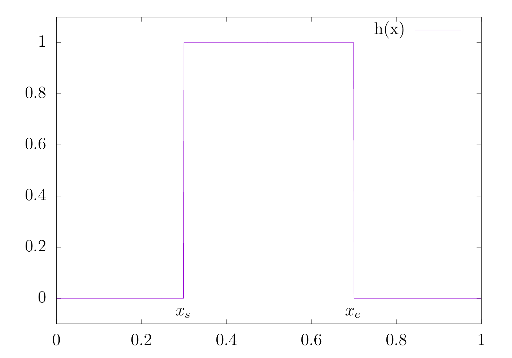

Le risque de la mauvaise anticipation du domaine $\Omega_K$ est que celui-ci déborde du support de $h$. Numériquement ce risque se traduit par l'apparition d'oscillations dues à une discontinuité de $g$ aux bords du support de $h$.

### $h$ une fonction trapèze

Considérons maintenant une fonction $h$ définie comme suit :

$$
  h_i = h(x_i) = \begin{cases}
    0                                               & \textrm{, si\ }           x_i < x_s     \\
     \frac{1}{x_s^*-x_s} x - \frac{x_s}{x_s^*-x_s}  & \textrm{, si\ } x_s     < x_i < x_s^{*} \\ 
    1                                               & \textrm{, si\ } x_s^{*} < x_i < x_e^{*} \\
    -\frac{1}{x_e-x_e^*} x + \frac{x_e}{x_e-x_e^* } & \textrm{, si\ } x_e^{*} < x_i < x_e     \\
    0                                               & \textrm{, si\ } x_e     < x_i           \\
  \end{cases}
$$

et est représentée sur la figure 5.2.

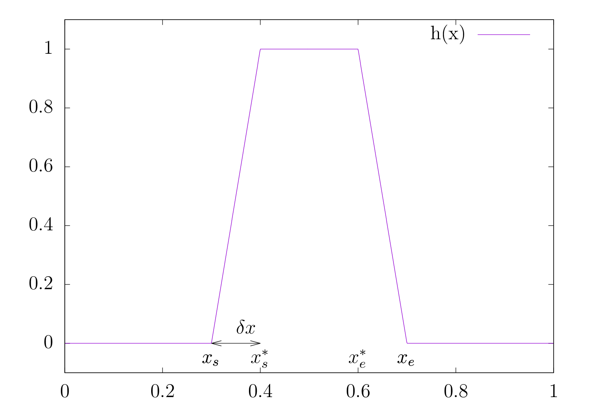

Pour les différents tests sur une telle fonction on conservera toujours les valeurs de $x_s$ et $x_e$ identiques au cas test de la fonction porte, nous allons donc jouer sur les valeurs de $x_s^*$ et $x_e^*$. On choisit généralement $x_s^*$ et $x_e^*$ de façon symétrique c'est-à-dire :

$$
  x_s^* = x_s + \delta x \qquad x_e^* = x_e - \delta x
$$

On obtient ainsi une fonction porte pour $\delta x = 0$ ou une fonction chapeau pour $\delta x = \frac{x_e-x_s}{2}$.

### $h(t,x)$ une fonction dépendant du temps

Maintenant essayons de faire évoluer $h$ en fonction du temps. Comme nous l'avons écrit précédemment il est possible d'utiliser la troisième composante du flux cinétique de $g$ pour construire $h(t,x)$, comme dans [@dimarco]. Ceci implique de calculer $g$ en tout point de l'espace, ce que l'introduction de la fonction $h$ nous permet en principe d'éviter. En effet, l'introduction de la fonction $h$ permet, dans la partie *micro*, plus coûteuse en temps de calcul que la partie *macro*, de ne parcourir l'espace qu'entre les valeurs $x_s$ et $x_e$.

À l'inverse des approches présentées dans [@dimarco] et [@filbet], nous avons besoin ici d'une connaissance amont du problème. Pour ce faire nous allons étudier la troisième composante du flux cinétique de $g$, sans fonction $h$. Au niveau discret, la troisième composante du flux cinétique de $g$ au temps final $T_f = N\Delta t$ est calculée par\ :

$$
  \sum_k v_k^3 g_{i,k}^N\Delta v
$${#eq:g:flux}

Une première simulation sur un tube de Sod (test décrit en section [5.4.2](#condition-aux-bords-de-neumann)) a été effectuée pour estimer le support de $g$ en espace en fin de simulation. Ce test est fait sur un domaine $\Omega=[0,1]$ avec des conditions aux bords de Neumann, jusqu'au temps final $T_f=0.067$, avec la condition initiale\ :

$$
  U(t=0,x) = \begin{cases}
    U_L = (\rho_L,u_L,T_L) = (1,0,1)       & , x \leq \frac{1}{2} \\
    U_R = (\rho_R,u_R,T_R) = (0.125,0,0.8) & , x >    \frac{1}{2}
  \end{cases}
$$

Le flux cinétique ([!eq:g:flux]) (respectivement le logarithme de ce flux) est représenté en figure 5.3(a) (respectivement en figure 5.3(b)).

  
  
  

Visualisation de la troisième composante du flux cinétique de $g$ en fin de simulation

Contrairement à ce qui était attendu le flux ne diminue pas suffisamment pour le contraindre dans une région. Le seuil que nous allons utiliser est $10^{-15}$, ce qui peut correspondre à la sortie du bruit numérique de la précision du zéro machine ; un seuil plus petit, aux alentours de $10^{-17}$ est envisageable mais se fait au détriment du temps de calcul. Un seuil acceptable et qui sera utilisé par la suite est $10^{-5}$, seuil lié à la précision possible des mesures et du bruit dû aux turbulences.

Nous définissons l'ensemble $\mathscr{I}^n$ défini par\ :

$$
  \mathscr{I}^n = \left\{ i\in [\![ 0 , N_x ]\!] , \left| \sum_k v_k^3 g_{i,k}^n \Delta v  \right| > 10^{-5} \right\}
$$

où $N_x$ correspond à la taille de la grille en espace. Cette ensemble, non nécessairement connexe, rassemble tous les indices $i$ où le flux cinétique de $g$ au temps $t^n$ dépasse une valeur seuil, ici fixé à $10^{-5}$. Nous considérons maintenant $i_s^n = \min \mathscr{I}^n$ et $i_e^n = \max \mathscr{I}^n$, ce qui nous permet de définir l'intervalle $[\![ i_s^n , i_e^n ]\!]$. Nous définissons ainsi les deux points de l'espace $x_s^n = i_s^n \Delta x$ et $x_e^n = i_e^n \Delta x$.

Sur la figure 5.4, $x_s$ correspond au premier dépassement du seuil de $10^{-15}$, et $x_e$ au dernier ; sont aussi représentées les valeurs de $x_s$ et $x_e$ précédemment choisies dans le cas d'une fonction porte.

Nous souhaitons que $h(t,x)$ enveloppe la zone où $\langle v_k^3g_{i,k}^n\rangle_v > 10^{-5}$, pour cela nous considérons deux fonctions $x_s^n$ et $x_e^n$ donnant au cours du temps le domaine cinétique. Cette démarche ne fonctionne pas telle quelle pour un système périodique, puisque la résolution du modèle s'effectue sur l'intervalle $[x_s,x_e]$ avec $x_s < x_e$. Des conditions aux bords périodiques n'assurent pas la condition $x_s < x_e$ ce qui pose des problèmes techniques pour les indices de parcours lors de l'implémentation. C'est pour cela que nous sommes restés avec des conditions aux bords de Neumann. Une implémentation efficace du cas d'intervalles disjoints est en cours de développement.

## Tests numériques dans le cas de gaz raréfiés

Dans cette section, nous allons présenter différents résultats numériques et comparer les performances du modèle *micro-macro*, dans le contexte d'un gaz raréfié c'est-à-dire en l'absence de champ électrique $E$ et dans un régime où $\varepsilon \ll 1$ pour pouvoir comparer les résultats à ceux obtenus par la résolution des équations d'Euler. Plusieurs cas tests de la littérature ont été utilisés pour démontrer la versatilité de la modélisation.

### Conditions aux bords périodiques

Le premier cas test que nous considérons est un domaine spatial $\Omega$ périodique avec pour condition initiale la fonction suivante\ :

$$
  f(t=0,x,v) = \frac{1}{\sqrt{2\pi}}(1 + \alpha\cos(k_x x))\text{e}^{-\frac{|v|^2}{2}}
$${#eq:ci:per:f}

avec les paramètres $\alpha$ et $k_x=0.5$ représentant respectivement la perturbation initiale et le nombre d'onde. Le domaine $\Omega$ est défini par $\Omega = [0,\frac{2\pi}{k_x}]$ pour assurer une période en $x$ de la condition initiale. La condition périodique se traduit par $f(t,0,v)=f(t,\frac{2\pi}{k_x},v)$ à tout instant $t$ pour tout $v$. Le domaine en $v$ est en théorie infini, numériquement il sera borné et inclu dans l'intervalle $[-v_{\text{max}},v_{\text{max}}]$, avec $v_{\text{max}}$ pris suffisamment grand pour que $f(t,x,v_{\text{max}})\approx 0$.

Nous allons comparer les résultats avec un code de simulation des équations d'Euler. Il est donc nécessaire de traduire la condition ([!eq:ci:per:f]) dans le domaine macroscopique pour définir les conditions initiales fluides\ :

$$
  U(t=0,x) = \begin{pmatrix} 1+\alpha\cos(k_x x) \\ 0 \\ 1+\alpha\cos(k_x x) \end{pmatrix}
$$

Les paramètres de simulation sont\ :

* Domaine spatial périodique $\Omega = [0,4\pi]$
* Domaine cinétique périodique $[-v_{\text{max}},v_{\text{max}}]$ avec $v_{\text{max}} = 18$
* Temps final $T_f = 10$
* Nombre de points : gille $(x,v)$ en $1000 \times 64$
* Perturbation $\alpha = \frac{1}{2}$
* Nombre d'onde $k_x = \frac{1}{2}$
* Nombre de Knudsen $\varepsilon = 10^{-4}$
* Pas de temps $\Delta t = \frac{1}{2}\frac{\Delta x}{v_{\text{max}}}$

Conformément au calcul de condition CFL effectué en section [4.3.1](#calcul-de-la-condition-cfl), nous n'avons pas de contrainte numérique liée à $\varepsilon$ sur le pas de temps $\Delta t$, lorsqu'un schéma *upwind* ou compact est considéré. Le schéma WENO, instable avec un schéma en temps Euler explicite oblige à conserver un pas de temps relativement faible.

Sur la figure 5.5 on observe un bon accord entre la modélisation par les équations d'Euler et le modèle cinétique avec $\varepsilon = 10^{-4}\ll 1$, ce qui est conforme avec la théorie. Le schéma en espace du modèle cinétique est un schéma *upwind* d'ordre 1 ; on remarque que ce schéma capture assez mal les forts gradients générés par la solution.

  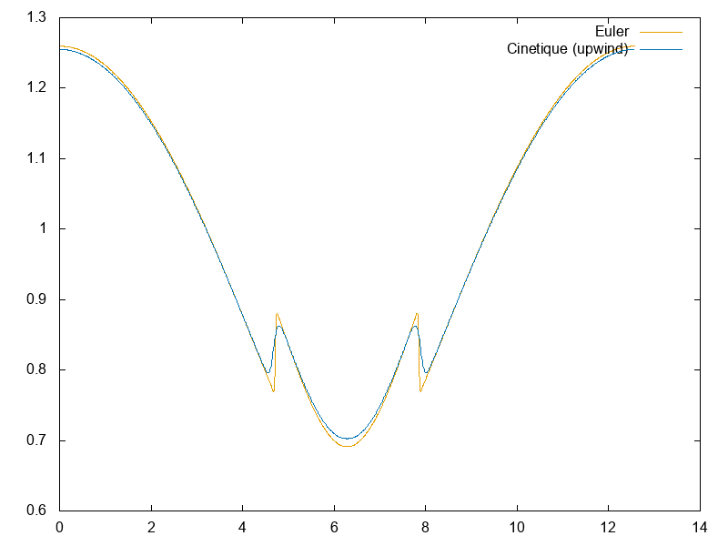

  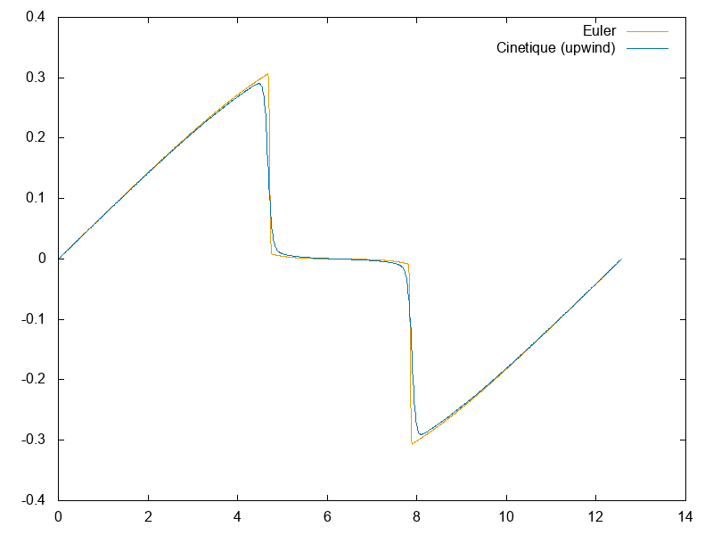
  
  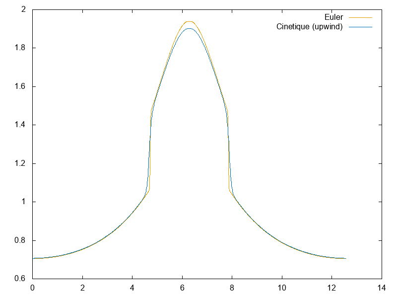

  Comparaison entre la modélisation par les équations d'Euler et le modèle cinétique sur un cas de conditions aux bords périodiques.

Nous testons sur ce même exemple les deux schémas d'ordre élevé présentés et présentons les résultats sur la figure 5.6. Le schéma compact présente une asymétrie que nous n'avons pas réussi à analyser, cela semble provenir d'une erreur d'implémentation mais la source exacte du problème n'a pas été identifiée. Le schéma compact, schéma d'ordre élevé, fait apparaître des oscillations dans les discontinuités, ce phénomène est visible dans les discontinuités de la vitesse. Le schéma WENO répond parfaitement à nos attentes en reproduisant les mêmes phénomènes que la simulation avec les équations d'Euler. Les indicateurs de continuités $\beta^{\pm}_i$ du schéma WENO permettent de limiter l'apparition de ces oscillations.

  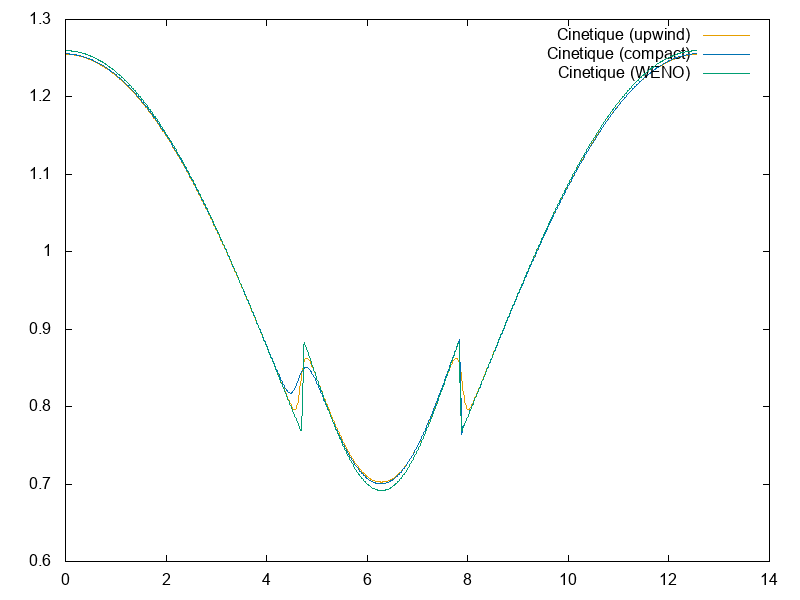

  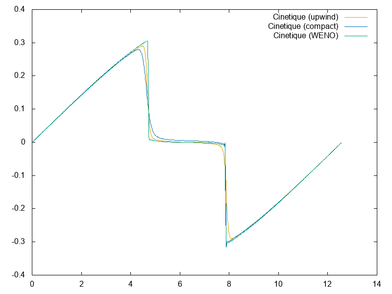
  
  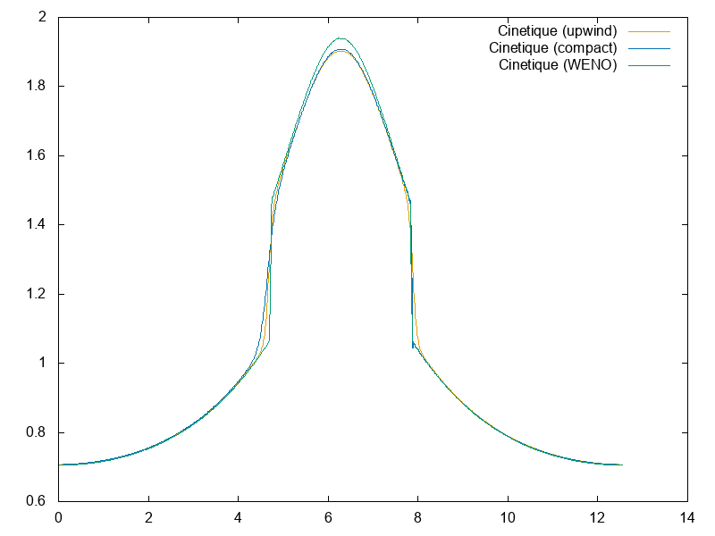

  Comparaison entre différents schémas du même problème aux conditions aux bords périodiques.

Cette étude a pour but de valider le modèle *micro-macro*. Nous nous intéressons donc à la comparaison entre les résultats du code de simulation cinétique et *micro-macro*. Sur les figures 5.7, on observe un très bon accord entre les résultats obtenus avec les 2 codes. Les petites différences dans les régions de fortes variations sont dues à la partie *macro* du modèle *micro-macro*, d'ordre plus faible.

  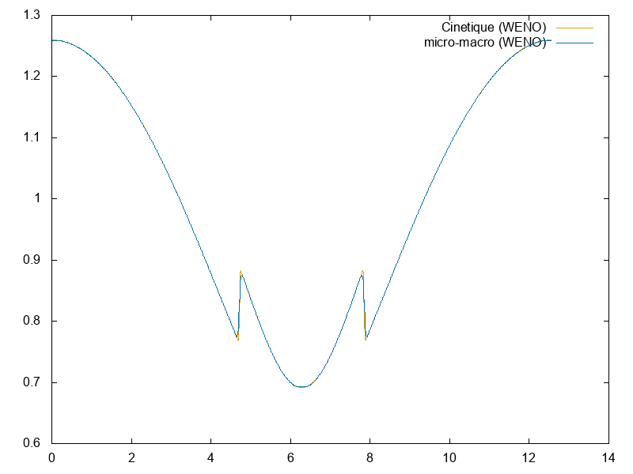

  
  
  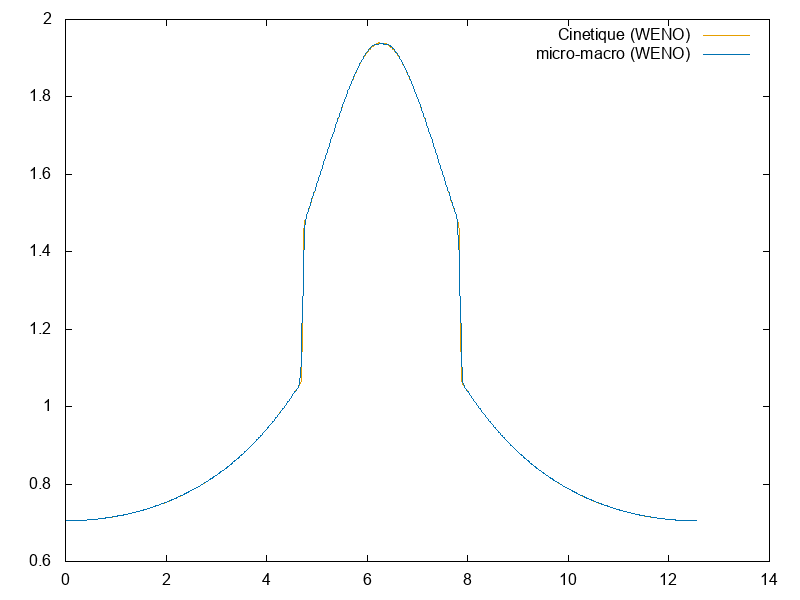

  Comparaison entre le modèle cinétique et *micro-macro* sur le problème aux conditions aux bords périodiques.

### Conditions aux bords de Neumann

Le second cas test abondant dans la littérature est le tube à choc de Sod ([@leveque]). La condition initiale est une fonction discontinue, le temps de simulation est suffisamment court pour éviter l'interaction de l'onde de choc avec les bords. Le tube est modélisé par un domaine $\Omega = [0,1]$. Les conditions aux bords sont des conditions de Neumann, c'est-à-dire $\partial_x f(t,0,v) = \partial_x f(t,1,v) = 0$ à tout instant $t$ pour toute vitesse $v$. Comme pour le cas test précédent, le domaine en $v$, théoriquement égal à $\mathbb{R}$, est numériquement restreint à l'intervalle $[-v_{\text{max}},v_{\text{max}}]$, avec $v_{\text{max}}$ pris suffisamment grand, et avec des conditions aux bords périodiques.

La simulation est initialisée par la condition initiale suivante ([@leveque])\ :

$$
  U(t=0,x) = \begin{cases}
    U_L = (\rho_L,u_L,T_L) = (1,0,1) \quad & , x \leq \frac{1}{2} \\
    U_R = (0.125,0,0.8)                    & , x > \frac{1}{2}
  \end{cases}
$$

Pour initialiser la simulation du modèle cinétique ou la partie *micro* du modèle *micro-macro* nous utilisons la maxwellienne associée à cette condition initiale\ :

$$
  f(t=0,x,v) = \mathcal{M}_{[U(t=0,x)]} \, g(t=0,x,v) = 0
$$

Les paramètres de simulations sont\ :

* Domaine spatial $\Omega = [0,1]$
* Domaine de la vitesse $[-v_{\text{max}},v_{\text{max}}]$ avec $v_{\text{max}} = 18$
* Temps final de simulation $T_f = 0.067$
* Grille de l'espace des phases $(x,v)$ : $1000 \times 64$
* Nombre de Knudsen $\varepsilon = 10^{-4}$

Le pas de temps $\Delta t$ peut de nouveau être choisi indépendamment de $\varepsilon$ conformément au calcul de la condition CFL de la partie [4.3.1](#calcul-de-la-condition-cfl).

Nous procédons ici de manière équivalente au cas test précédent. Nous validons le modèle cinétique en le comparant aux équations d'Euler, dont nous montrons les résultats sur la figure 5.8. La simulation cinétique est faite avec un schéma *upwind* d'ordre faible. Comme précédemment, on observe la diffusion numérique du schéma *upwind* près des zones à fort gradients ($x\equiv 0.4$ et $x\equiv 0.65$).

  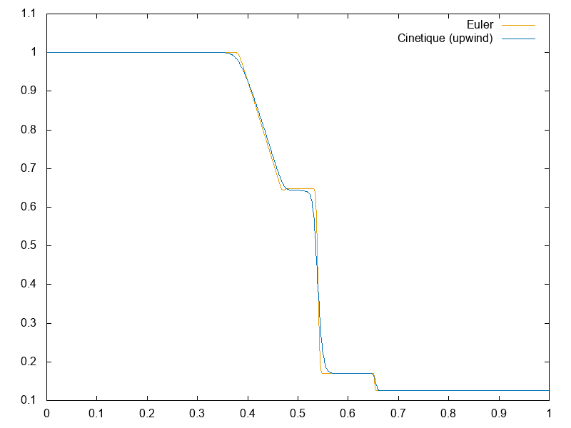

  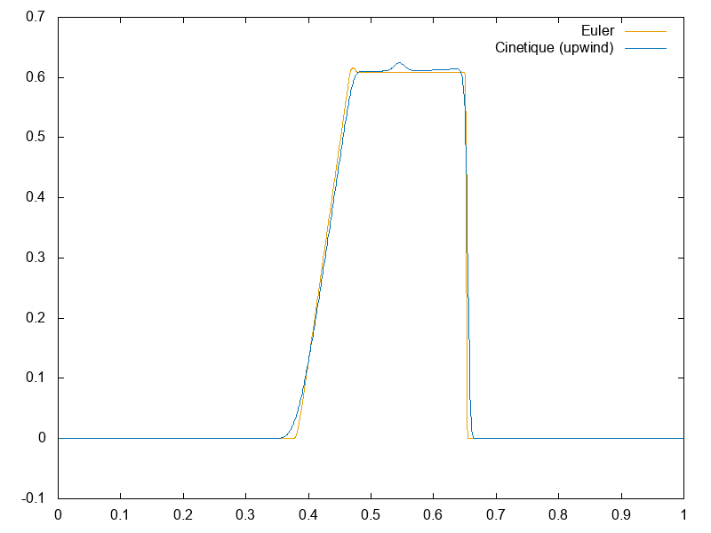
  
  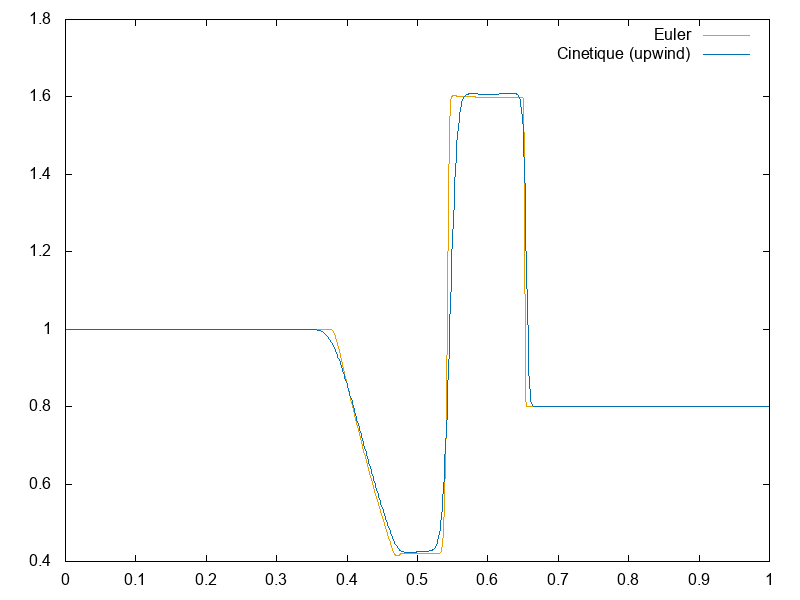

  Comparaison entre la modélisation avec les équations d'Euler et le modèle cinétique sur le problème du tube de Sod.

Nous testons maintenant différents schémas en espace sur le modèle cinétique, résultats présentés sur la figure 5.9. Les schémas d'ordre élevé (compact et WENO) capturent mieux les zones de forts gradients. Le schéma compact, provoque des oscillations à l'approche d'une discontinuité, ce constat est bien mis en évidence sur la vitesse moyenne où on observe une oscillation en amont et aval de la discontinuité (autour de $x=0.65$ sur la figure 5.9). Le schéma WENO est construit pour se prémunir de ce phénomène. 

  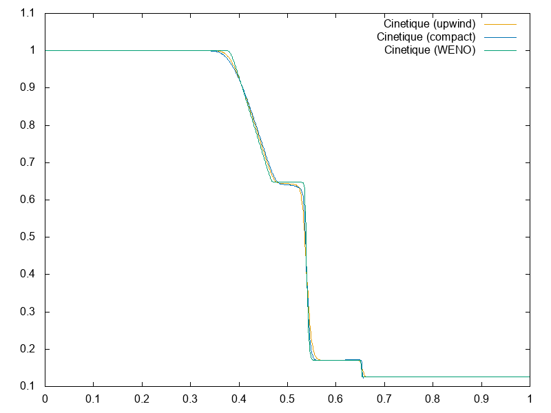

  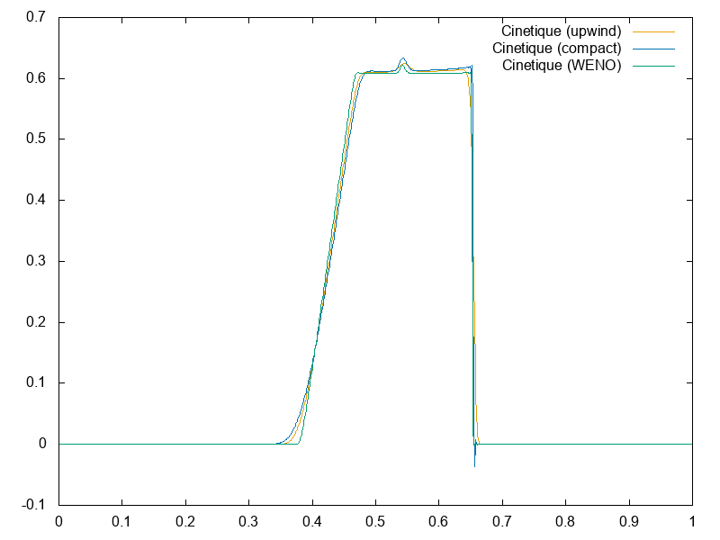
  
  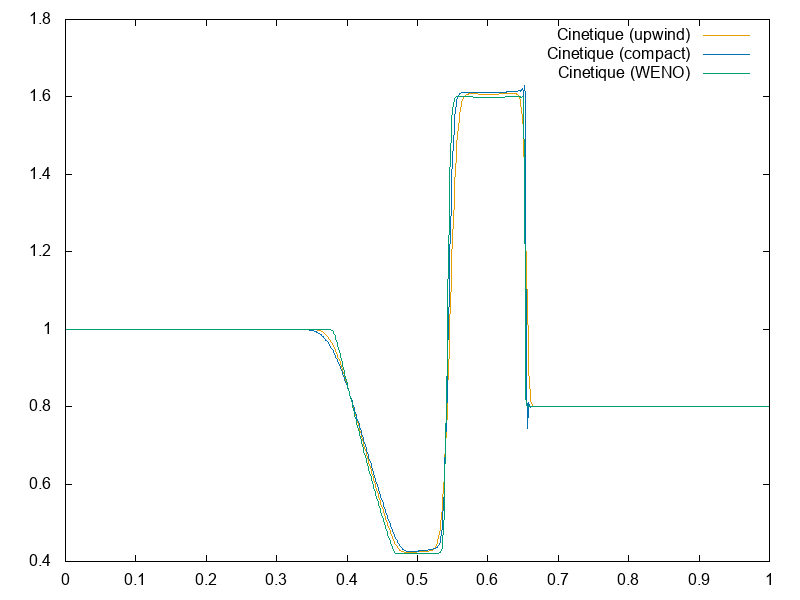

  Comparaison entre les schémas *up-wind*, compact et WENO avec une modélisation cinétique sur le problème du tube de Sod.

Nous pouvons maintenant tester le modèle *micro-macro* dans le cas du tube à choc de Sod, résultat que nous présentons sur la figure 5.10. On remarque de faibles différences dues à la partie *macro* qui reproduit des comportements déjà observés avec notre code de simulation des équations d'Euler. Par exemple, sur la température, on remarque que le modèle *micro-macro* reproduit à la fois l'oscillation en début de crête, aussi présente sur les résultats du code de simulation des équations d'Euler, et l'oscillation en milieu de crête, présente sur le modèle cinétique.

  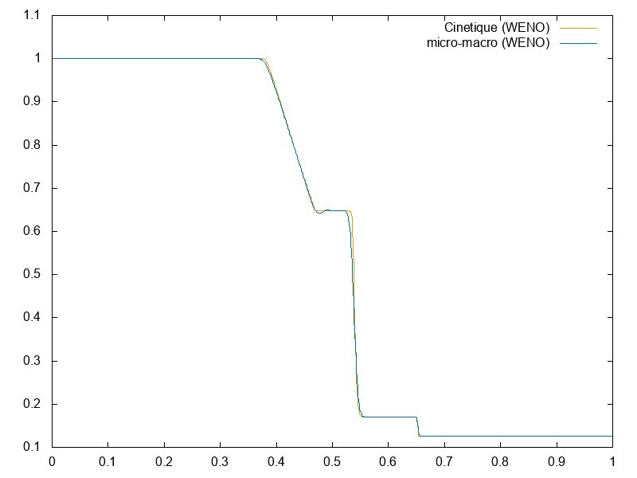

  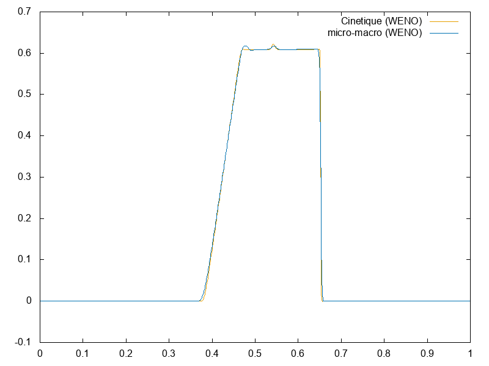
  
  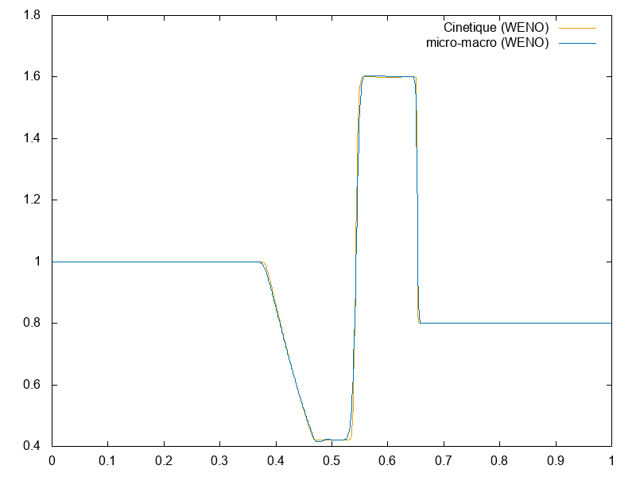

  Comparaison entre le modèle cinétique et *micro-macro* dans le cas test du tube de Sod.

Ce cas test, avec le précédent, met à l'épreuve la modélisation *micro-macro* ainsi que son implémentation avec un schéma d'ordre élevé WENO d'ordre 5. Nous validons ainsi le programme réalisé sur deux cas tests classiques.

### Fonction de transition $h$

Nous reprenons pour ces tests le cas du tube de Sod avec des conditions aux bords de Neumann. Plusieurs fonctions $h$ ont été testées, décrites dans la section [5.3](#approximation-du-modèle-micro-macro-avec-htx). La simulation est initialisée par la condition initiale\ :

$$
  U(t=0,x) = \begin{cases}
    U_L = (\rho_L,u_L,T_L) = (1,0,1) \quad & , x \leq \frac{1}{2} \\
    U_R = (0.125,0,0.8)                    & , x > \frac{1}{2}
  \end{cases}
$$

Pour initialiser la simulation du modèle cinétique ou la partie *micro* du modèle *micro-macro* nous utilisons la maxwellienne de cette condition initiale\ :

$$
  f(t=0,x,v) = \mathcal{M}_{[U(t=0,x)]} \, g(t=0,x,v) = 0
$$

Les paramètres de simulations sont\ :

* Domaine spatial $\Omega = [0,1]$
* Domaine en vitesse $[-v_{\text{max}},v_{\text{max}}]$ avec $v_{\text{max}} = 18$
* Temps final de simulation $T_f = 0.067$
* Grille de l'espace des phases $(x,v)$ : $1000 \times 64$
* Nombre de Knudsen $\varepsilon = 1$

Les résultats précédents sont les résultats de simulation dans le régime fluide où le système est proche de son état d'équilibre thermodynamique : $\varepsilon \ll 1$ ($g\approx 0$ sur tout le domaine $\Omega$). Pour mettre en évidence l'approximation du modèle *micro-macro* à l'aide de la fonction $h$, nous nous plaçons maintenant dans le régime cinétique : $\varepsilon = 1$.

Nous tracerons la troisième composante du flux cinétique en fin de simulation ($t=T_f=N\Delta t$), c'est-à-dire\ :

$$
  \int_{\mathbb{R}} v^3 g(t=T_f,x,v)\,\mathrm{d}v \approx \sum_{k} v_k^3 g_{i,k}^N \Delta v
$$

grandeur sur laquelle les erreurs dues à l'approximation sont les plus visibles. Numériquement on vérifie bien que les deux premières composantes du flux sont nulles (oscillations d'amplitudes inférieures à $10^{-14}$), c'est-à-dire\ :

$$
  \begin{aligned}
    \sum_k v_k   g_{i,k}^N &\approx 0 \\
    \sum_k v_k^2 g_{i,k}^N &\approx 0
  \end{aligned}
$$

Cela permet de confirmer numériquement la propriété démontrée dans la sous-section [5.2.4](#propriétés-du-schéma).

#### $h$ une fonction porte

Le premier exemple est une fonction porte définie en ([!eq:hgate:theo]). Il s'agit plus d'un démonstrateur technique qu'un test intéressant numériquement. Il permet aussi d'étudier les limites de la méthode avec l'introduction d'une fonction porte trop *étroite* pour la simulation, c'est-à-dire, en réutilisant les notations de la section [5.3](#approximation-du-modèle-micro-macro-avec-htx)\ :

$$
  [x_s,x_e] \subset \Omega_K
$$

Nous considérons tout d'abord, une fonction porte relativement large (figure 5.11) : $x_s = 0.27$ et $x_e = 0.73$. Nous constatons que ceci influe que très peu sur la valeur du flux de $g$ puisque les résultats obtenus sont presque confondus aux résultats de référence obtenus avec le code *micro-macro* avec une fonction $h(x) = 1$. Une fonction porte plus étroite : $x_s = 0.32$ et $x_e = 0.68$ implique des discontinuités dans le flux de $g$, discontinuité pouvant entrainer des oscillations dans le cas de l'utilisation du schéma compact. Ceci est dû au fait que $g$ n'est pas nulle pour $x \not\in [0.32,0.68]$.

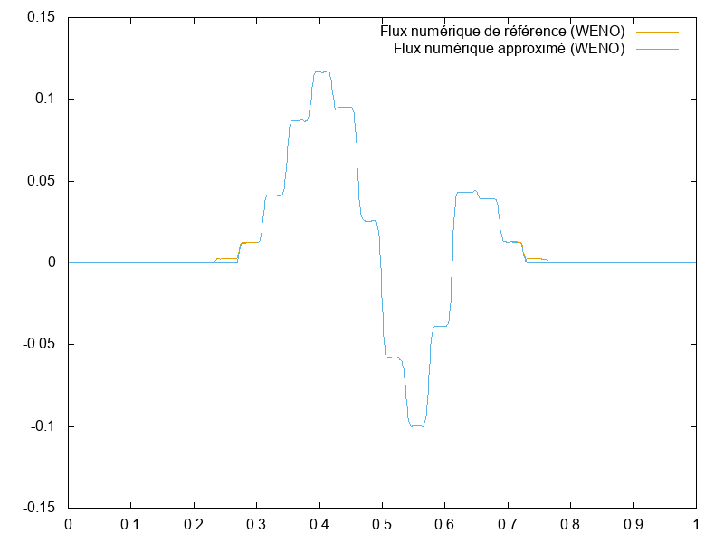

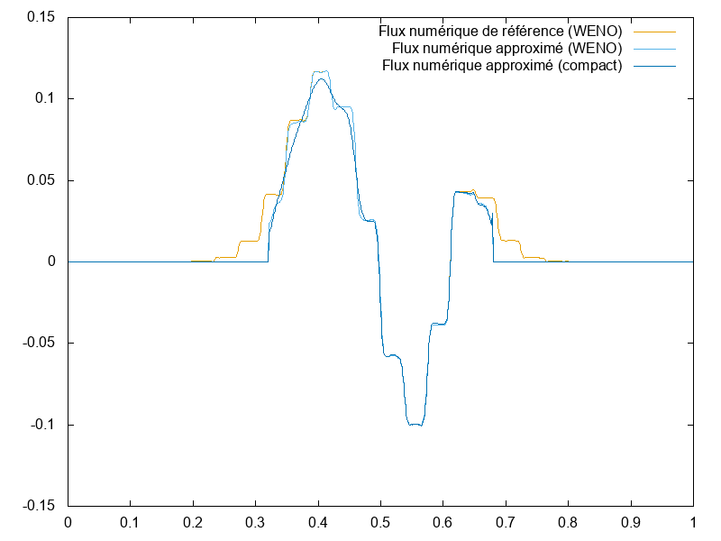

#### $h$ une fonction trapèze

L'utilisation d'une fonction trapèze permet d'obtenir une transition plus douce entre les sous-domaines $\Omega_K$ et $\Omega_F$. L'approche utilisée dans [@dimarco] correspond à une fonction $h$ en créneaux.

La transition progressive entre $\Omega_K$ et $\Omega_F$ permet de se prémunir des oscillations dues à une mauvaise étude amont du problème. Cela ne garantit pas la validité des résultats.

Nous effectuons la simulation avec les valeurs $x_s = 0.27$, $x_e=0.73$ et $\delta x = 0.05 = 50\Delta x$ en réutilisant les notations de la section [5.3](#approximation-du-modèle-micro-macro-avec-htx). Nous obtenons une zone de transition relativement large entre $\Omega_F$ et $\Omega_K$.

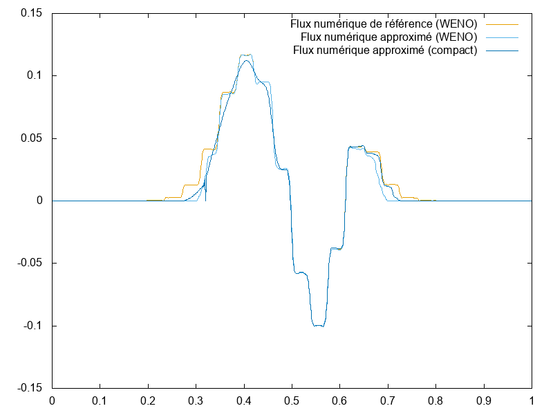

#### $h(t,x)$ une fonction dépendant du temps

Dans le cas du tube à choc de Sod, l'onde de choc se propage depuis le centre du domaine en s'étendant. Il n'est donc pas nécessaire d'évaluer le modèle cinétique sur tout le sous-domaine $[x_s,x_e]$ précédemment utilisé dans le cas d'une fonction porte suffisamment large. Une fonction $h$ dynamique en temps est nécessaire pour être plus précis par rapport aux cas tests tout en permettant de diminuer le temps de calcul.

La construction de notre fonction $h$ dépendante du temps s'est faite *a posteriori*. Elle a nécessité une première étude du cas test sur tout le domaine, avec éventuellement un maillage plus grossier. Aucune procédure d'automatisation d'obtention de cette fonction n'a été envisagée, autre que celles que nous avons pu évoquer dans la littérature, mais il est possible d'ajouter facilement une étape dans l'algorithme.

Nous avons déterminé numériquement le support du flux de $g$ au cours du temps, comme ce qui a été observé en section [5.3.3](#htx-une-fonction-dépendant-du-temps). L'intervalle $[x_s(t),x_e(t)]$ avec $x_s$ et $x_e$ deux fonctions affines définies par\ :

$$
  \begin{cases}
    x_s:t\mapsto -9.5 x +0.45 \\
    x_e:t\mapsto 9.5 x +0.55 \\
  \end{cases}
$$

permet de bien capturer le support du flux de $g$.

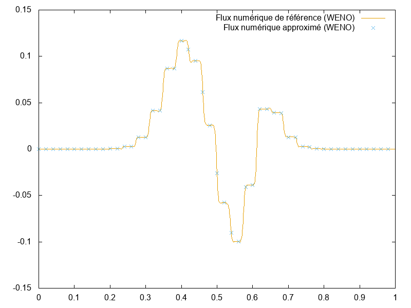

Dans ce cas, le résultat épouse parfaitement le résultat de référence. La fonction de transition $h(t,x)$ est une fonction trapèze déterminée à chaque itération.

Notre implémentation permet de diminuer le temps de simulation car nous parcourons la grille seulement sur le support de $h(t,x)$, c'est-à-dire sur l'intervalle $[\![ x_s , x_e ]\!]$ en réutilisant les notations de [5.3.3](#htx-une-fonction-dépendant-du-temps). Nous avons observer une diminution du temps de calcul d'un facteur 2 environ.

# Conclusion

Nous avons pu au cours de ce stage étudier plusieurs modèles de la physique des plasmas, en particulier les modèles microscopique, cinétique et macroscopique, seuls les deux derniers ont bénéficié d'une attention plus particulière dans cette étude. Le modèle macroscopique (étudié en section [2.2](#modèle-macroscopique)), peu coûteux en temps de calcul et espace mémoire, ne permet de décrire qu'un système à l'équilibre thermodynamique, c'est-à-dire un système où la distribution des particules en vitesse est supposée maxwellienne. Le modèle cinétique (étudié en section [2.3](#modèle-cinétique)) quant à lui propose une description plus précise des phénomènes dits *hors-équilibre*, au détriment d'un coût numérique plus important. Nous avons élaboré un modèle hybride fluide-cinétique *micro-macro* pour associer les avantages de ces deux approches dans la section [3](#modèles-hybrides-fluides-cinétiques). L'intérêt de ce modèle est de servir de base pour effectuer des approximations, en particulier de la partie *micro*, coûteuse en temps de calcul. Cela s'est fait par l'introduction d'une fonction de transition $h$ (dans la section [3.3](#approximation-du-modèle-micro-macro)) dont le fonctionnement est similaire à celui d'une décomposition de domaine. Une connaissance amont du problème permet de construire une telle fonction de transition permettant de résoudre le modèle cinétique seulement sur la région hors-équilibre. 

Dans la section [4](#présentation-des-schémas) nous nous sommes intéressés à différents schémas numériques d'ordre élevé pour résoudre au mieux notre modèle *micro-macro*. Deux schémas en espace d'ordre élevé ont été implémentés et comparés : les schémas compacts et le schéma WENO d'ordre 5. Notre étude s'est orientée vers l'utilisation du schéma WENO qui se comporte mieux dans le cas de discontinuités et de forts gradients.

Nos schémas ont été testés sur deux cas proches d'un cas fluide classique (voir sections [5.4.1](#conditions-aux-bords-périodiques) et [5.4.2](#conditions-aux-bords-de-neumann)), c'est-à-dire $\varepsilon \to 0$. Ces tests ont permis de valider notre approche *micro-macro*. L'approximation à l'aide de la fonction $h(t,x)$ (dans la section [5.4.3](#fonction-de-transition-h)) fut l'objet de différents tests avec une implémentation particulière permettant de réduire le temps de calcul d'environ un facteur 2, en parcourant le domaine de calcul uniquement sur le support de la fonction de transition.

Le travail prospectif pour la suite de l'étude a déjà avancé. Un code permettant de résoudre le modèle de Vlasov-Poisson ([!eq:cine:vp]), est en phase de validation, en utilisant soit le modèle cinétique soit le modèle *micro-macro* développé au cours de ce stage. Celui-ci permet de retrouver des résultats de la physique des plasmas comme visible en figure 6.1. 

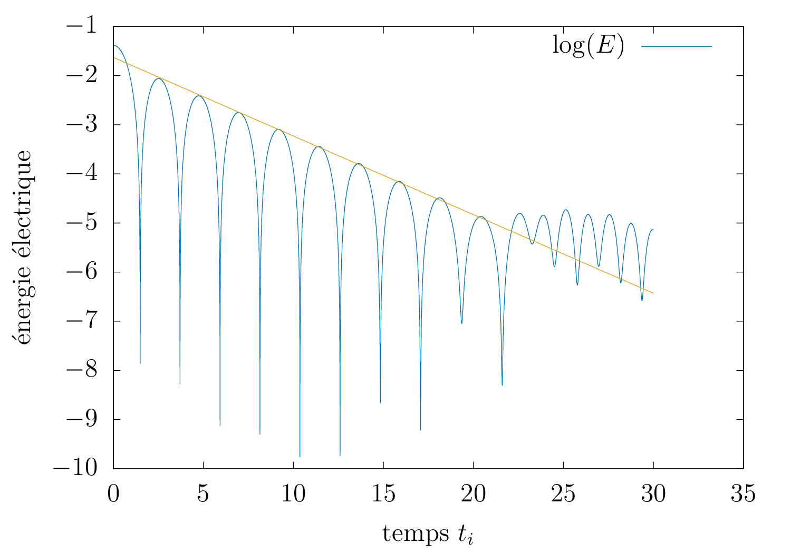

Dans les perspectives de cette étude nous pouvons évoquer l'introduction d'une fonction de transition $h(v)$, permettant une décomposition de domaine dans l'espace des vitesses, pour étudier des systèmes où des particules rapides coexistent avec des particules à l'équilibre. Cette approximation nécessite l'élaboration de cas tests pertinents physiquement pour certifier l'intérêt de cette étude. L'introduction de cas tests physiques mène à l'élaboration de schéma multi-dimensionnels en traitant complètement le modèle en 6 dimensions. En plus des problèmes mathématiques liés à l'introduction de dimensions supplémentaires (gestion des conditions aux bords et la connexion entre les modèles par exemple), se pose le problème de la gestion du temps de calcul et surtout de la mémoire. Il devient donc intéressant d'évoquer une possible parallélisation (encore non effectuée) ainsi qu'une gestion dynamique de la mémoire liée au domaine $\Omega_K$ lors de l'approximation du modèle *micro-macro* à l'aide d'une fonction $h(t,x)$.

